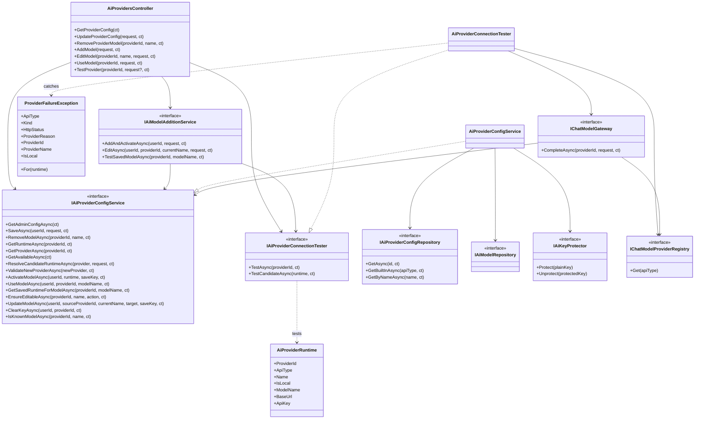
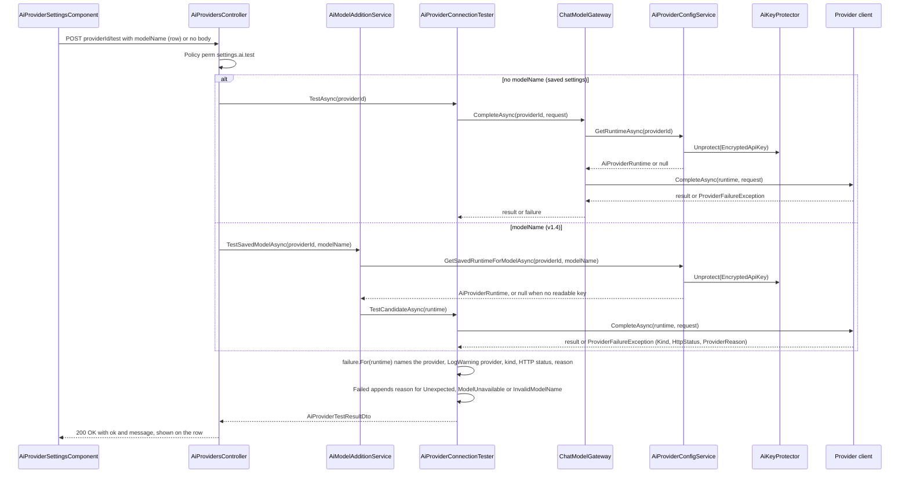
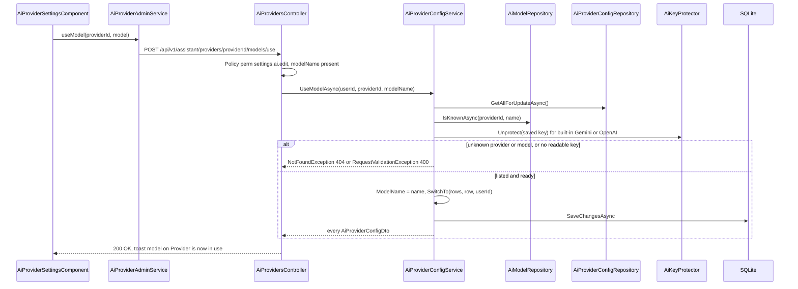
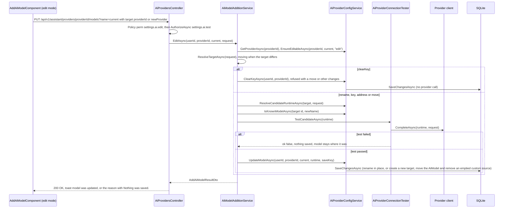
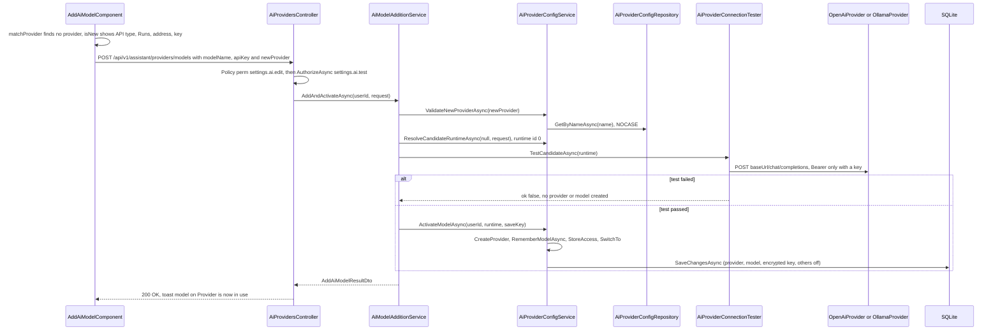
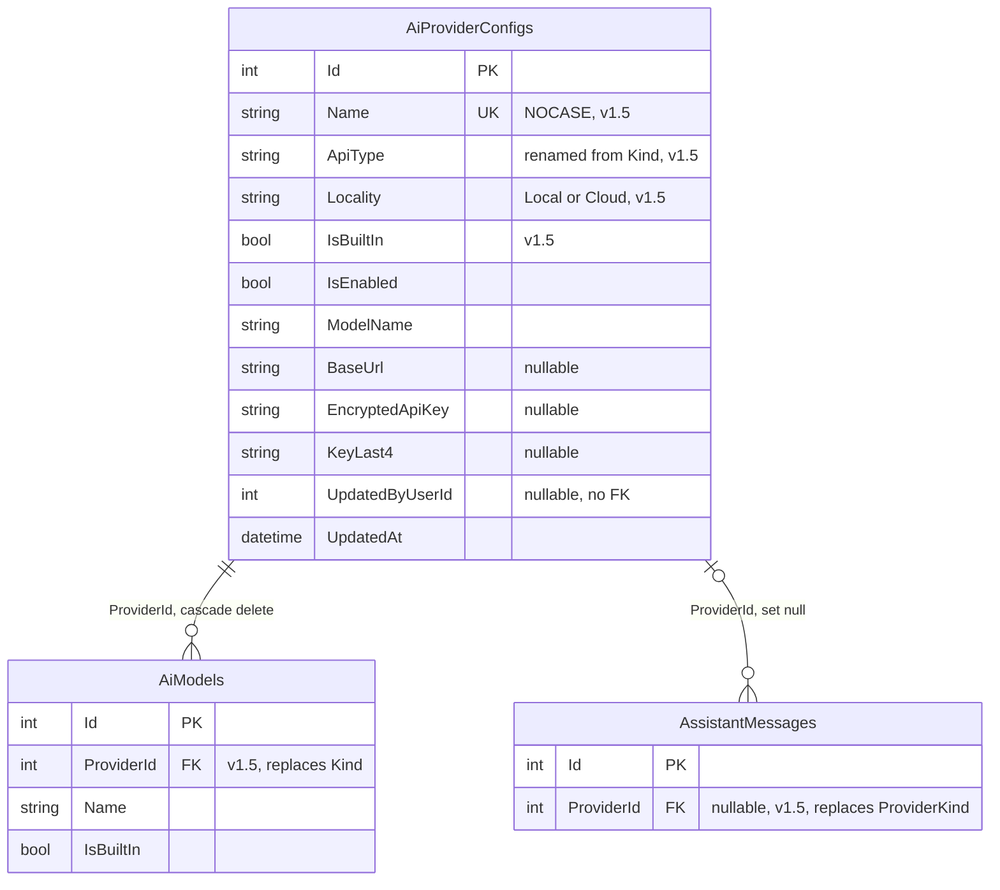

# Low-Level Design – TFA Settings

## TaskFlow – Intelligent Task Allocation & Tracking System

> **Document:** Low-Level Design  ·  **Version:** 1.5  ·  **Status:** Draft
> **Project type:** Personal Project (Skill Development)  ·  **Date:** 01-Nov-2026
> **Author:** Jojo George (jojogeorge3344@gmail.com)
> **Based on:** HLD-TFA-Settings v1.4, FRD-TFA-Settings v1.5
> **Module:** Settings  ·  **Sub-module:** 06.3 TFA Settings  ·  **Code:** TFAS
> © 2026 Jojo George. All rights reserved.

---

## Document Control

| Version | Date | Author | Summary of changes |
|---|---|---|---|
| 1.0 | 31-Oct-2026 | Jojo George | Initial version |
| 1.1 | 31-Oct-2026 | Jojo George | TFA answers TaskFlow questions from the documents folder (OpenSpec change `tfa-document-rag`): `DocumentIndexController` (2 actions, `/api/v1/assistant/documents`), `IDocumentIndexService` / `DocumentIndexService`, `DocumentIndexStatusDto`, `DocumentIndexCardComponent`, `AiProviderAdminService.getDocumentStatus()` / `reindexDocuments()`; `AiProviders:OllamaContextTokens`; cloud text; tests and FR-TFAS-29 – FR-TFAS-36 traceability. |
| 1.2 | 01-Nov-2026 | Jojo George | OpenSpec change `tfa-document-rag` revised (design D13, D14). Removed: `DocumentIndexController` (`GET /api/v1/assistant/documents/status`, `POST /api/v1/assistant/documents/reindex`, both now 404), `IDocumentIndexService` / `DocumentIndexService`, `DocumentIndexStatusDto` (`DocumentIndexDtos.cs`) and its DI registration, `DocumentIndexCardComponent`, `ai-provider-admin.model.ts`, `getDocumentStatus()` / `reindexDocuments()`, `DocumentIndexerService.RequestReindex()`; tests `DocumentIndexEndpointsTests` and `document-index-card.component.spec.ts` replaced by `DocumentIndexEndpointsRemovedTests`. Added: model-ID rule (`BeAModelId`, `ModelIdMessage`) in both model-name validators and the Add AI model form (`modelId`, `MODEL_ID_EXAMPLES`, Gemini key hint); `GeminiProvider` maps a 400 model-name error to `ModelUnavailable`; `ProviderFailureException.ProviderReason` (`ProviderHttp.Reason`); `AiProviderConnectionTester` appends the provider reason and logs a warning on both test paths. Built-in Gemini models `gemini-3.8-flash` (default), `gemini-3.5-flash`, `gemini-3.5-flash-lite`. Add-model endpoint and `AddAiModelComponent` listed in the inventory and API table. FR-TFAS-29 – FR-TFAS-36 withdrawn in traceability. |
| 1.3 | 01-Nov-2026 | Jojo George | OpenSpec change `tfa-gemini-model-id-validation`. `AiProviderCatalog.NormalizeModelName` / `IsValidModelId` / `ModelIdMessage` (Gemini format, `models/` removed); enforced in `AiProviderConfigService.SaveAsync` and `ResolveCandidateRuntimeAsync`; new `ProviderFailureKind.InvalidModelName`, mapped by `GeminiProvider.Classify` from a 400 model-name error, with its own `ProviderFailureMessages` text and the provider reason on Test connection; Add AI model form `MODEL_ID_RULES` / `MODEL_ID_MESSAGES` / `normalizeModelName`, re-checked when the provider changes. |
| 1.4 | 01-Nov-2026 | Jojo George | OpenSpec change `tfa-model-list-and-edit`. Controller actions `UseModel` (`POST {kind}/models/use`), `EditModel` (`PUT {kind}/models?name=`) and `TestProvider(kind, body?)` (optional `{ modelName }`); `AiProviderConfigService.UseModelAsync`, `GetSavedRuntimeForModelAsync`, `EnsureEditableAsync`, `UpdateModelAsync`, `ClearKeyAsync`, `IsKnownModelAsync`, private `SwitchTo` / `IsInUseAsync`; `RemoveModelAsync` uses the new in-use and built-in rules and resets a switched-off provider's saved model; `AiModelAdditionService.EditAsync`, `TestSavedModelAsync`; DTO `AiModelChoiceRequest`; `AddAiModelRequest.ClearKey` with the validator rule "Provide a new key or clear the key, not both."; `IAiProviderConfigRepository.UsesModelAsync` removed. Frontend: `AiProviderSettingsComponent` rewritten as a read-only model list (`groups`, `inUse`, `busy`, `testing`, `results`; `use`, `test`, `edit`, `remove`; `ModelRow` / `ProviderGroup` replace `ProviderForm`), `AiProviderAdminService.useModel` / `editModel` / `test(kind, modelName?)`, `AddAiModelComponent` edit mode (`editing`, `startEditing`, `removeKey`), route `settings/tfa/models/:kind/:name/edit`, `ConfirmOptions.notice`. `PUT config` kept but no longer called by the screen. API table, class diagram, service logic, sequence diagrams, validation, errors, frontend design, tests, limitations and traceability (FR-TFAS-40 – FR-TFAS-48) updated. No migration. |
| 1.5 | 01-Nov-2026 | Jojo George | OpenSpec change `tfa-custom-ai-providers`. Providers are data and identified by `providerId`: `AiProviderKind` renamed `AiApiType` (`OpenAI` = OpenAI-compatible); `AiProviderConfigs` gains `Name` (≤ 40, unique, NOCASE), `ApiType` (renamed from `Kind`), `Locality`, `IsBuiltIn`; `AiModels.Kind` → `ProviderId` (FK cascade, unique `(ProviderId, Name)`); `AssistantMessages.ProviderKind` → `ProviderId` (nullable FK, set null); migration `20261101050239_AddCustomAiProviders`. BREAKING routes `{providerId:int}`; add model is `POST /providers/models` with `providerId` or `newProvider` (`NewAiProviderRequest`); `PUT {providerId}/models` accepts a target and moves the model. New `GetProviderAsync`, `ValidateNewProviderAsync`, `ResolveCandidateRuntimeAsync(provider?, request)`, private `ReleaseModelAsync` / `CreateProvider`; repositories `GetAsync(id)`, `GetBuiltInAsync(apiType)`, `GetByNameAsync(name)`; `AiProviderRuntime(ProviderId, ApiType, Name, IsLocal, ModelName, BaseUrl, ApiKey)`; `ProviderFailureException.For(runtime)`; `OpenAiProvider` with any address, optional key and a retry without tools; registry `Get(apiType)`; gateway `CompleteAsync(providerId, …)`. Frontend: AI provider text input with datalist, `matchProvider`, `isNew`, `moveTarget`, `CUSTOM_API_TYPES`; custom provider groups; route `settings/tfa/models/:providerId/:name/edit`. New tests `CustomProvidersMigrationTests`, `CustomProviderTests`, `CustomProviderEndpointsTests` and OpenAI-compatible / gateway cases. Traceability FR-TFAS-49 – FR-TFAS-58. |

**Related documents:** BRD · FRD · HLD · TDD · Specs

| Document | Location |
|---|---|
| BRD – TFA Settings | `../../../BRD/06-Settings/06.3-TFA-Settings/BRD-TFA-Settings.md` |
| FRD – TFA Settings (FR-TFAS-01…58, UC-TFAS-01…06; FR-TFAS-29…36 withdrawn in v1.2; FR-TFAS-04, FR-TFAS-19 withdrawn in FRD v1.4) | `../../../FRD/06-Settings/06.3-TFA-Settings/FRD-TFA-Settings.md` |
| OpenSpec change (custom AI providers, v1.5) | `openspec/changes/tfa-custom-ai-providers/` (proposal, design, specs `ai-custom-providers` and `ai-provider-management`, tasks) |
| HLD – TFA Settings | `../../../HLD/06-Settings/06.3-TFA-Settings/HLD-TFA-Settings.md` |
| Overall LLD (stack, cross-cutting design, Auth) | `../../00-Overall/LLD-TaskFlow-Overall.md` |
| LLD – Assistant (chat, `ChatModelGateway` callers, provider selector; document index, indexer and search in 4.1.3) | `../../08-TFA-Assistant/08.1-Assistant/LLD-Assistant.md` |
| LLD – Role Configuration (the four `settings.ai.*` keys and their prerequisite) | `../06.4-Role-Configuration/LLD-Role-Configuration.md` |
| TDD v2.3 | `TDD-TaskFlow.md` §6.5 (integrations), §7.2.6 (`AiProviderConfig`, `AiModel`, `DocumentSource`, `DocumentChunk`), §8.9 (Settings endpoints), §16.8 (document knowledge) |

---

## 1. Introduction

### 1.1 Purpose
Detailed design of TFA Settings – the organization-wide configuration of the AI providers behind TFA, the TaskFlow
assistant: controller actions, configuration and connection-test services, repositories, key protection, provider
clients, the `AiProviderConfigs` and `AiModels` tables, seeding, the Angular screens (since v1.4 a read-only model list
and an edit mode of the Add AI model page), tests and FR-TFAS-nn traceability. Since v1.5 a provider is a stored record
identified by `providerId` – the three built-in providers and any number of custom providers (API type OpenAI-compatible
or Ollama) – created on a passing test, listed like the built-in ones and removed when emptied; a model can move between
providers on Edit.
(The v1.1 Document search card and its endpoints were removed in v1.2.)
Everything is taken from the code as built.

### 1.2 Scope & Conventions
- Covered: `AiProvidersController` (7 actions, v1.4; routes by `providerId` since v1.5), `AiProviderConfigService`, `AiModelAdditionService`,
  `AiProviderConnectionTester`, `AiProviderConfigRepository`, `AiModelRepository`, `AiKeyProtector`,
  `KeyRingProtectionCheck`, `AiProviderSeeder`, `AiProviderCatalog`, the migration `AddCustomAiProviders` (v1.5), the provider clients used by the test,
  `AiProviderSettingsComponent`, `AddAiModelComponent` (add and edit mode) and the notice mode of `ConfirmDialogComponent`
  (`tf-confirm-dialog`, v1.4).
- Removed in v1.2: `DocumentIndexController` (2 actions), `DocumentIndexService` and `DocumentIndexCardComponent`
  (v1.1). TFA Settings has no view of the document index.
- Referenced only (v1.1): the document indexer, search and tables (`DocumentIndexerService`, `DocumentIndexStatus`,
  `DocumentIndexer`, `DocumentSources`, `DocumentChunks`), designed in the Assistant LLD 4.1.3; since v1.2 their
  problems are reported only as log warnings.
- Referenced only: `GET /api/v1/assistant/providers` (Assistant sub-module, `assistant.chat`), which returns the
  configured providers through `AiProviderConfigService.GetAvailableAsync` (`AiProviderOptionDto` with `ProviderId`,
  v1.5); chat calls through `IChatModelGateway`; `AssistantMessages.ProviderId` (v1.5, designed in the Assistant LLD).
- Naming: `*Controller`, `I*Service`/`*Service`, `I*Repository`/`*Repository`, DTOs `*Dto` / `*Request`.
- API base path `/api/v1`; JSON camelCase; enums as strings; errors as ProblemDetails.

---

## 2. Code Structure

### 2.1 Backend Folder Layout

```
TaskFlow.Api/
  Controllers/Settings/AiProvidersController.cs
  Services/Settings/TfaSettings/ProviderConfig/IAiProviderConfigService.cs, AiProviderConfigService.cs
  Services/Settings/TfaSettings/ModelAddition/IAiModelAdditionService.cs, AiModelAdditionService.cs
  Services/Settings/TfaSettings/ConnectionTest/IAiProviderConnectionTester.cs, AiProviderConnectionTester.cs
  (removed in v1.2: Controllers/Settings/DocumentIndexController.cs, Services/Settings/TfaSettings/DocumentIndex/,
   Dtos/Settings/TfaSettings/DocumentIndexDtos.cs)
  Repositories/Settings/TfaSettings/ProviderConfig/IAiProviderConfigRepository.cs, AiProviderConfigRepository.cs
  Repositories/Settings/TfaSettings/AiModels/IAiModelRepository.cs, AiModelRepository.cs
  Dtos/Settings/TfaSettings/AiProviderDtos.cs
  Dtos/Settings/TfaSettings/Validators/UpdateAiProvidersRequestValidator.cs   (+ UpdateAiProviderRequestValidator)
  Dtos/Settings/TfaSettings/Validators/AddAiModelRequestValidator.cs
  Models/Entities/AiProviderConfig.cs, AiModel.cs   (AssistantMessage.cs: ProviderId, v1.5)
  Models/Enums/AiApiType.cs (v1.5; renamed from AiProviderKind.cs), ProviderFailureKind.cs
  Common/Constants/AiProviderCatalog.cs
  Integrations/Ai/KeyProtection/IAiKeyProtector.cs, AiKeyProtector.cs, KeyRingProtectionCheck.cs
  Integrations/Ai/Providers/OllamaProvider.cs, GeminiProvider.cs, OpenAiProvider.cs, ProviderHttp.cs,
                            ProviderFailure.cs, AiProviderRuntime.cs, ChatModelTypes.cs, IChatModelProvider.cs
  Integrations/Ai/Registry/IChatModelProviderRegistry.cs, ChatModelProviderRegistry.cs
  Services/Assistant/ModelGateway/IChatModelGateway.cs, ChatModelGateway.cs     (Assistant module)
  Services/Assistant/Chat/ProviderFailureMessages.cs                           (Assistant module)
  Config/AiProviderOptions.cs, Config/IntegrationRegistration.cs
  Persistence/Seeders/AiProviderSeeder.cs
  Persistence/AppDbContext.cs                                                  (provider, model and message mapping)
  Persistence/Migrations/20261101050239_AddCustomAiProviders.cs                (v1.5)
```

### 2.2 Frontend Folder Layout

```
src/app/modules/settings/
  settings.routes.ts                                               (routes settings/tfa, settings/tfa/models/new,
                                                                   settings/tfa/models/:providerId/:name/edit (v1.5;
                                                                   v1.4: :kind))
  tfa-settings/pages/tfa-settings.component.ts                     (TfaSettingsComponent, page wrapper)
  tfa-settings/pages/add-ai-model.component.{ts,html,css}          (AddAiModelComponent, add and edit mode, MODEL_ID_EXAMPLES,
                                                                   CUSTOM_API_TYPES, matchProvider (v1.5))
  tfa-settings/components/ai-provider-settings.component.{ts,html,css}
  tfa-settings/components/ai-provider-settings.model.ts            (ModelRow, ProviderGroup; v1.4, replaces ProviderForm)
  tfa-settings/services/ai-provider-admin.service.ts               (AiProviderAdminService)
  (removed in v1.2: services/ai-provider-admin.model.ts with DocumentIndexStatus; components/document-index-card.component.*)
src/app/modules/assistant/models/assistant.model.ts                (AiProviderConfig (providerId, apiType, isBuiltIn, v1.5),
                                                                   UpdateAiProvider, AiProviderTestResult,
                                                                   AddAiModelRequest (clearKey, v1.4; providerId,
                                                                   newProvider, v1.5), NewAiProvider, AddAiModelResult)
src/app/shared/components/confirm-dialog/confirm-dialog.{component,model}.ts   (ConfirmOptions.notice, v1.4)
```

### 2.3 Layer Rules

| Rule | Enforced by |
|---|---|
| Controller → Service → Repository only, through interfaces | `ArchitectureTests` |
| Services commit through `IUnitOfWork`; repositories never save | `ArchitectureTests` |
| Provider HTTP clients live in `Integrations/`, called only through `IChatModelProviderRegistry` / `IChatModelGateway` | Code structure (`ArchitectureTests` namespace rules) |
| Child component in `components/`, `loadComponent` target in `pages/` | `npm run check:structure` |

---

## 3. Cross-Cutting Design

Shared mechanisms are in the overall LLD. Applied here:

| Concern | Design |
|---|---|
| Validation | `UpdateAiProvidersRequestValidator` (+ per-item `UpdateAiProviderRequestValidator`) and `AddAiModelRequestValidator` in `ValidationFilter`; extra rules in the service throw `RequestValidationException` (400 with `errors`) |
| Error handling | `GlobalExceptionHandler`; the connection test never fails with an error status |
| Transactions | One `SaveChangesAsync` per save, use, edit, clear key or delete; on `UniqueConstraintException` during a save duplicate models are detached and saved again; during a rename (v1.4) or a move (v1.5) it becomes "That model is already in the list." (400). (v1.5) Creating a custom provider with its model and key, and a move (new target, source model removed, target model added, emptied custom source removed), are each one save |
| Authorization | Class `[Authorize]` + one `[RequirePermission]` per action (`settings.ai.view`, `settings.ai.edit`, `settings.ai.model.remove`, `settings.ai.test`); the add-model and (v1.4) edit-model actions also check `settings.ai.test` in code. (v1.2: `DocumentIndexController` removed) |
| Logging | `ChatModelGateway` logs provider, failure kind and HTTP status only; `AiProviderConnectionTester` (`TestAsync` and `TestCandidateAsync`) logs a warning with provider, failure kind, HTTP status and `ProviderReason` (v1.2); `GetRuntimeAsync` warns when an enabled key cannot be decrypted; provider HTTP clients have all loggers removed |
| Secrets | API keys encrypted with ASP.NET Core Data Protection (`AiKeyProtector`), never returned or logged |

### 3.1 Exception → HTTP Status

| Exception | Status | When |
|---|---|---|
| Validation failure (`ValidationFilter`) | 400 | Request rules (3 below) |
| `RequestValidationException` | 400 | Missing provider field, model length, key for Ollama; (v1.4) edit or delete a built-in model or the model in use, use a model of a cloud provider without a readable key, rename to a listed name, `clearKey` with other changes; (v1.5) no provider in an add ("Enter the AI provider."), `providerId` and `newProvider` together, an invalid new provider (name length or taken, API type Gemini, address missing or unsafe, locality), a duplicate name on the move target, `clearKey` with a move |
| `BusinessRuleException` | – | _Removed in v1.2_ (was: `POST /api/v1/assistant/documents/reindex` while `DocumentKnowledge:Enabled` is false; the route now answers 404) |
| `ValidationProblem` in the action | 400 | `DELETE …/models` or `PUT …/models` without `name`; `POST …/models/use` without `modelName` (v1.4) |
| Model binding (`[ApiController]`) | 400 | _Withdrawn in v1.5:_ `{kind}` not an `AiProviderKind` value. Since v1.5 a route value that is not an int does not match `{providerId:int}` (404) |
| `NotFoundException` | 404 | Model to remove, use, edit or test (v1.4) not in the list; (v1.5) unknown `providerId` in the route or body ("That AI provider does not exist.") |
| Policy failure | 403 | Missing the action's permission |
| `UniqueConstraintException` (not recovered) | 409 | Unique index broken by something other than a duplicate model |
| `ProviderNotConfiguredException`, `ProviderFailureException` | 200 | Caught by `AiProviderConnectionTester` and returned as `ok: false` |

---

## 4. Module Designs

### 4.1 Module: Settings

#### 4.1.1 Child module: TFA Settings (TFAS)

**Class / file inventory**

| Layer | Type | File | Responsibility |
|---|---|---|---|
| Controller | `AiProvidersController` | `Controllers/Settings/AiProvidersController.cs` | 7 actions under `/api/v1/assistant/providers` (v1.4: `UseModel`, `EditModel` added; `TestProvider` takes an optional body; v1.5: routes `{providerId:int}`, `AddModel` at `POST models` without an id) |
| Controller (v1.1, removed in v1.2) | `DocumentIndexController` (`GetStatus`, `Reindex`) | _deleted_ | Was 2 actions under `/api/v1/assistant/documents` |
| Service (v1.1, removed in v1.2) | `IDocumentIndexService` / `DocumentIndexService` (`GetStatus`, `RequestReindex`) | _deleted_ (`Services/Settings/TfaSettings/DocumentIndex/`) | Was the status mapping and re-index request |
| DTO (v1.1, removed in v1.2) | `DocumentIndexStatusDto` | _deleted_ (`Dtos/Settings/TfaSettings/DocumentIndexDtos.cs`) | Was the status contract |
| Service | `IAiModelAdditionService` / `AiModelAdditionService` | `Services/Settings/TfaSettings/ModelAddition/` | Add AI model: test the typed values, save and activate only on success (`AddAndActivateAsync(userId, request)`, v1.5: the provider is `request.ProviderId` or `request.NewProvider`, created on a pass); (v1.4) edit an added model after a passing test or clear its provider's key (`EditAsync`, v1.5: with a target, a move), test a listed model with the saved key or address (`TestSavedModelAsync`); private `ResolveTargetAsync` (v1.5) |
| Service | `IAiProviderConfigService` / `AiProviderConfigService` | `Services/Settings/TfaSettings/ProviderConfig/` | Admin view, save, remove model, runtime for calls, available providers; (v1.4) `UseModelAsync`, `GetSavedRuntimeForModelAsync`, `EnsureEditableAsync`, `UpdateModelAsync`, `ClearKeyAsync`, `IsKnownModelAsync`, private `SwitchTo`; (v1.5) all keyed by `providerId`, `GetProviderAsync`, `ValidateNewProviderAsync`, `ResolveCandidateRuntimeAsync(provider?, request)`, `ActivateModelAsync` creating the provider when the runtime id is 0, `UpdateModelAsync` rename or move, private `CreateProvider`, `ReleaseModelAsync` (removes an emptied custom provider), `StoreAccess`, `RequiresKey` / `TakesKey` / `UsesAddress` |
| Service | `IAiProviderConnectionTester` / `AiProviderConnectionTester` | `Services/Settings/TfaSettings/ConnectionTest/` | One "Reply with OK." call (`TestAsync` saved settings, `TestCandidateAsync` typed values); result DTO with the provider reason for `Unexpected` / `ModelUnavailable`; warning log |
| Repository | `IAiProviderConfigRepository` / `AiProviderConfigRepository` | `Repositories/Settings/TfaSettings/ProviderConfig/` | Provider rows (v1.4: `UsesModelAsync` removed; v1.5: `GetAsync(id)`, `GetBuiltInAsync(apiType)`, `GetByNameAsync(name)`) |
| Repository | `IAiModelRepository` / `AiModelRepository` | `Repositories/Settings/TfaSettings/AiModels/` | Model list by `providerId` (v1.5), duplicate-race recovery |
| DTOs | `AiProviderConfigDto`, `AiProviderOptionDto`, `UpdateAiProviderRequest`, `UpdateAiProvidersRequest`, `AiProviderTestResultDto`, `AddAiModelRequest` (v1.4: `ClearKey`; v1.5: `ProviderId`, `NewProvider`), `NewAiProviderRequest` (v1.5), `AddAiModelResultDto`, `AiModelChoiceRequest` (v1.4) | `Dtos/Settings/TfaSettings/AiProviderDtos.cs` | Contracts |
| Validators | `UpdateAiProvidersRequestValidator`, `UpdateAiProviderRequestValidator` (`BeHttpUrl`, `BeAModelId`, `ModelIdMessage`), `AddAiModelRequestValidator` (v1.4: not a new key and `ClearKey` together) | `Dtos/Settings/TfaSettings/Validators/` | Request rules, SSRF guard `IsMetadataHost`, model-ID rule (v1.2) |
| Entities | `AiProviderConfig` (v1.5: the provider record, `Name`, `ApiType`, `Locality`, `IsBuiltIn`, `Models`), `AiModel` (v1.5: `ProviderId`, `Provider`) | `Models/Entities/` | Tables |
| Enums | `AiApiType` (v1.5; renamed from `AiProviderKind`), `ProviderFailureKind` | `Models/Enums/` | Values in 5.4 |
| Catalogue | `AiProviderCatalog` | `Common/Constants/AiProviderCatalog.cs` | Per API type (v1.5): built-in display name and locality, default and built-in models, model ID rule (`NormalizeModelName`, `IsValidModelId`, `ModelIdMessage`), `DefaultOllamaBaseUrl`, `Local` / `Cloud`; a provider's own name, locality and key need come from its row |
| Key protection | `IAiKeyProtector` / `AiKeyProtector`, `KeyRingProtectionCheck` | `Integrations/Ai/KeyProtection/` | `Protect`/`Unprotect` (purpose `TaskFlow.AiProviderKeys`); start-up key-ring check |
| Gateway | `IChatModelGateway` / `ChatModelGateway` | `Services/Assistant/ModelGateway/` | Runtime lookup by `providerId` (v1.5), provider call, failure attached to the provider (`For(runtime)`) and logged |
| Registry / clients | `ChatModelProviderRegistry` (`Get(apiType)`, v1.5), `OllamaProvider`, `GeminiProvider`, `OpenAiProvider` (v1.5: any address, optional key, retry without tools), `ProviderHttp` (`Reason`, `MaxReasonLength` 200, v1.2) | `Integrations/Ai/Registry/`, `Integrations/Ai/Providers/` | HTTP calls, failure classification, cleaned provider reason |
| Runtime | `AiProviderRuntime(ProviderId, ApiType, Name, IsLocal, ModelName, BaseUrl, ApiKey)` (v1.5) | `Integrations/Ai/Providers/AiProviderRuntime.cs` | What one call needs, key decrypted; id 0 = a new provider not created yet |
| Failure types | `ProviderFailureException` (`ApiType`, `Kind`, `RetryAfter`, `HttpStatus`, `ProviderReason` v1.2; v1.5: `ProviderId`, `ProviderName`, `IsLocal` set by `For(runtime)`), `ProviderNotConfiguredException` (v1.5: `ProviderId`, `ProviderName`) | `Integrations/Ai/Providers/ProviderFailure.cs` | Classified provider failure |
| Messages | `ProviderFailureMessages` | `Services/Assistant/Chat/ProviderFailureMessages.cs` | Fixed user messages per failure kind, naming the provider (v1.5: `For(name, local, apiType, kind, retryAfter)`) |
| Options | `AiProviderOptions` | `Config/AiProviderOptions.cs` | `KeyRingPath`, `TimeoutSeconds`, `OllamaContextTokens` (v1.1) |
| Seeder | `AiProviderSeeder` | `Persistence/Seeders/AiProviderSeeder.cs` | Missing built-in provider rows and built-in models keyed on them (v1.5); custom providers never touched |
| Migration | `AddCustomAiProviders` | `Persistence/Migrations/20261101050239_AddCustomAiProviders.cs` | v1.5: provider columns, ids instead of kind, data mapped onto the built-in rows (5.5) |
| Frontend page | `TfaSettingsComponent` | `tfa-settings/pages/tfa-settings.component.ts` | Page header + child component (no Document search card since v1.2) |
| Frontend page | `AddAiModelComponent` | `tfa-settings/pages/add-ai-model.component.ts` | Add AI model form; `MODEL_ID_EXAMPLES` placeholder per API type; `modelId` validator; Gemini key hint (v1.2); (v1.4) edit mode `editing`, `startEditing`, `removeKey`; (v1.5) provider text input with datalist, `matchProvider`, `selected`, `isNew`, `apiType`, `source`, `moveTarget`, `CUSTOM_API_TYPES`, `newProviderChecks`, `usesAddress`, `takesKey` |
| Frontend component | `AiProviderSettingsComponent` | `tfa-settings/components/ai-provider-settings.component.ts` | (v1.4) Read-only model list grouped by provider (v1.5: by provider id, custom groups after the built-ins); `use`, `test`, `edit`, `remove` per row; in-use notice and delete confirmation through one `tf-confirm-dialog` (v1.0 – v1.3: forms per provider, linked Model/Server selects, save, remove) |
| Frontend model | `ModelRow`, `ProviderGroup` | `tfa-settings/components/ai-provider-settings.model.ts` | One row (`provider`, `model`, `added`, `inUse`, `ready`) and the rows of one provider (v1.4; replaces `ProviderForm`) |
| Shared component | `ConfirmDialogComponent` (`tf-confirm-dialog`), `ConfirmOptions` | `shared/components/confirm-dialog/` | (v1.4) `notice?: boolean`: only the confirm button (for example "OK") is shown |
| Frontend service | `AiProviderAdminService` | `tfa-settings/services/ai-provider-admin.service.ts` | `getConfig()`, `save()` (no longer called by the screen, v1.4), `removeModel(providerId, name)`, `test(providerId, modelName?)` (v1.4), `addModel(body)` (v1.5: `POST models`, no id in the route), `useModel(providerId, modelName)` (v1.4), `editModel(providerId, name, body)` (v1.4); v1.5: every route by `providerId`; (v1.1 `getDocumentStatus()`, `reindexDocuments()` removed in v1.2) |
| Frontend component (v1.1, removed in v1.2) | `DocumentIndexCardComponent` (`app-document-index-card`) | _deleted_ | Was the Document search card with `DOCUMENT_STATUS_POLL_MS` 3000 polling |

**Class diagram**


```mermaid
classDiagram
  class AiProvidersController {
    +GetProviderConfig(ct)
    +UpdateProviderConfig(request, ct)
    +RemoveProviderModel(providerId, name, ct)
    +AddModel(request, ct)
    +EditModel(providerId, name, request, ct)
    +UseModel(providerId, request, ct)
    +TestProvider(providerId, request?, ct)
  }
  class IAiModelAdditionService {
    <<interface>>
    +AddAndActivateAsync(userId, request, ct)
    +EditAsync(userId, providerId, currentName, request, ct)
    +TestSavedModelAsync(providerId, modelName, ct)
  }
  class ProviderFailureException {
    +ApiType
    +Kind
    +HttpStatus
    +ProviderReason
    +ProviderId
    +ProviderName
    +IsLocal
    +For(runtime)
  }
  class AiProviderRuntime {
    +ProviderId
    +ApiType
    +Name
    +IsLocal
    +ModelName
    +BaseUrl
    +ApiKey
  }
  class IAiProviderConfigService {
    <<interface>>
    +GetAdminConfigAsync(ct)
    +SaveAsync(userId, request, ct)
    +RemoveModelAsync(providerId, name, ct)
    +GetRuntimeAsync(providerId, ct)
    +GetProviderAsync(providerId, ct)
    +GetAvailableAsync(ct)
    +ResolveCandidateRuntimeAsync(provider, request, ct)
    +ValidateNewProviderAsync(newProvider, ct)
    +ActivateModelAsync(userId, runtime, saveKey, ct)
    +UseModelAsync(userId, providerId, modelName, ct)
    +GetSavedRuntimeForModelAsync(providerId, modelName, ct)
    +EnsureEditableAsync(providerId, name, action, ct)
    +UpdateModelAsync(userId, sourceProviderId, currentName, target, saveKey, ct)
    +ClearKeyAsync(userId, providerId, ct)
    +IsKnownModelAsync(providerId, name, ct)
  }
  class AiProviderConfigService
  class IAiProviderConnectionTester {
    <<interface>>
    +TestAsync(providerId, ct)
    +TestCandidateAsync(runtime, ct)
  }
  class AiProviderConnectionTester
  class IAiProviderConfigRepository {
    <<interface>>
    +GetAsync(id, ct)
    +GetBuiltInAsync(apiType, ct)
    +GetByNameAsync(name, ct)
  }
  class IAiModelRepository {
    <<interface>>
  }
  class IAiKeyProtector {
    <<interface>>
    +Protect(plainKey)
    +Unprotect(protectedKey)
  }
  class IChatModelGateway {
    <<interface>>
    +CompleteAsync(providerId, request, ct)
  }
  class IChatModelProviderRegistry {
    <<interface>>
    +Get(apiType)
  }
  AiProvidersController --> IAiProviderConfigService
  AiProvidersController --> IAiProviderConnectionTester
  AiProvidersController --> IAiModelAdditionService
  IAiModelAdditionService --> IAiProviderConnectionTester
  IAiModelAdditionService --> IAiProviderConfigService
  AiProviderConfigService ..|> IAiProviderConfigService
  AiProviderConfigService --> IAiProviderConfigRepository
  AiProviderConfigService --> IAiModelRepository
  AiProviderConfigService --> IAiKeyProtector
  AiProviderConnectionTester ..|> IAiProviderConnectionTester
  AiProviderConnectionTester --> IChatModelGateway
  AiProviderConnectionTester --> IChatModelProviderRegistry
  AiProviderConnectionTester ..> ProviderFailureException : catches
  IAiProviderConnectionTester ..> AiProviderRuntime : tests
  IChatModelGateway --> IAiProviderConfigService
  IChatModelGateway --> IChatModelProviderRegistry
```

(v1.2: `DocumentIndexController`, `IDocumentIndexService` / `DocumentIndexService` and their links to
`DocumentIndexStatus` and `DocumentIndexerService.RequestReindex()` were removed from this diagram and from the code.)

**API contracts**

Controller `AiProvidersController`, `[Route("api/v1/assistant/providers")]`, class `[Authorize]`.
Endpoints of this sub-module (`AiProvidersController`): **7** (v1.4: `POST {kind}/models/use` and `PUT {kind}/models` added; v1.2: the two `DocumentIndexController` endpoints were removed). **BREAKING in v1.5:** every provider route uses `{providerId:int}` instead of `{kind}`, and adding a model moved from `POST {kind}/models` to `POST models`; an unknown id answers 404 "That AI provider does not exist." The frontend changed together with the API; there are no external clients.

| # | Method | Route | Permission / policy | Request | Response | Status codes |
|---|---|---|---|---|---|---|
| 1 | GET | `/api/v1/assistant/providers/config` | `settings.ai.view` | – | `IReadOnlyList<AiProviderConfigDto>` (built-in providers in catalogue order Ollama, Gemini, OpenAI, then custom providers by name, v1.5) | 200, 401, 403 |
| 2 | PUT | `/api/v1/assistant/providers/config` | `settings.ai.edit` | `UpdateAiProvidersRequest` (v1.5: items carry `ProviderId`, replacing `Kind`; unknown id 404) | `IReadOnlyList<AiProviderConfigDto>` (kept for compatibility; not called by the screen since v1.4) | 200, 400, 401, 403, 404, 409 |
| 3 | DELETE | `/api/v1/assistant/providers/{providerId}/models` | `settings.ai.model.remove` | route `providerId`, query `name` | `IReadOnlyList<AiProviderConfigDto>`; 400 for a built-in model ("A built-in model cannot be changed or removed.") or the model in use ("`name` is in use by TFA. Switch TFA to another model first, then delete it.") (v1.4); a custom provider left with no models is removed with its key (v1.5) | 200, 400, 401, 403, 404 |
| 4 | POST | `/api/v1/assistant/providers/{providerId}/test` | `settings.ai.test` | route `providerId`, empty body or (v1.4) `AiModelChoiceRequest` `{ modelName }` | `AiProviderTestResultDto`: without a body the saved settings (`TestAsync`); with `modelName` that listed model with the saved key or address, even when the provider is switched off (`TestSavedModelAsync`) | 200, 400, 401, 403, 404 (unknown provider or model) |
| 7 | POST | `/api/v1/assistant/providers/models` (v1.5; v1.4: `{kind}/models`) | `settings.ai.edit` (+ `settings.ai.test` checked in the action) | `AddAiModelRequest` `{ modelName, apiKey?, baseUrl?, providerId? \| newProvider? }` – exactly one of `providerId` and `newProvider` | `AddAiModelResultDto` (`ok: false` and `providers: null` when the test fails; a new provider is created only on `ok: true`) | 200, 400, 401, 403, 404 |
| 8 | POST | `/api/v1/assistant/providers/{providerId}/models/use` (v1.4) | `settings.ai.edit` | route `providerId`, `AiModelChoiceRequest` `{ modelName }` | `IReadOnlyList<AiProviderConfigDto>`; 404 "That AI provider does not exist." / "That model is not in the list."; 400 "No key saved for `DisplayName` yet. Add it on the Add AI model screen." | 200, 400, 401, 403, 404 |
| 9 | PUT | `/api/v1/assistant/providers/{providerId}/models?name={current}` (v1.4) | `settings.ai.edit` (+ `settings.ai.test` checked in the action) | route `providerId` (the model's current provider), query `name`, `AddAiModelRequest` `{ modelName, apiKey?, baseUrl?, clearKey?, providerId? \| newProvider? }`; v1.5: the body's `providerId` / `newProvider` is the **target** – when it differs from the route's provider the edit is a move; neither keeps the provider | `AddAiModelResultDto` (`ok: false`, `providers: null` when the test fails); 400 for a built-in model, the model in use ("… then edit it."), a duplicate name on the target ("That model is already in the list."), `clearKey` with other changes or a move ("Remove the key on its own, without other changes.") or a key and `clearKey` together ("Provide a new key or clear the key, not both.") | 200, 400, 401, 403, 404 |

`{providerId:int}` is the `AiProviderConfigs.Id` of a built-in or custom provider (v1.5). _Withdrawn in v1.5: "`{kind}` binds to `AiProviderKind` (`Ollama`, `Gemini`, `OpenAI`)."_

Controller `DocumentIndexController`, `[Route("api/v1/assistant/documents")]` (v1.1): **removed in v1.2**. Both routes now
answer 404 (`DocumentIndexEndpointsRemovedTests`).

| # | Method | Route | Permission / policy | Request | Response | Status codes |
|---|---|---|---|---|---|---|
| 5 | GET | `/api/v1/assistant/documents/status` | _Removed in v1.2_ (was `settings.ai.view`) | – | (was `DocumentIndexStatusDto`) | 404 |
| 6 | POST | `/api/v1/assistant/documents/reindex` | _Removed in v1.2_ (was `settings.ai.edit`) | – | (was `DocumentIndexStatusDto`, 202) | 404 |

**DTOs**

| DTO | Fields |
|---|---|
| `AiProviderConfigDto` | `ProviderId` (v1.5; replaces `Kind`), `DisplayName` (the provider's `Name`), `ApiType` (`AiApiType`, v1.5), `IsBuiltIn` (v1.5), `Locality` (`Local`/`Cloud`, from the row since v1.5), `RequiresKey` (true only for built-in Gemini and OpenAI, v1.5), `IsEnabled`, `ModelName`, `BaseUrl` (Ollama and custom providers; null for built-in Gemini and OpenAI), `KeySet`, `KeyLast4`, `IsConfigured`, `KeyReadable`, `Models` (all names, chosen one added if missing), `CustomModels` (non-built-in; every model of a custom provider) |
| `UpdateAiProvidersRequest` | `Providers` (`IReadOnlyList<UpdateAiProviderRequest>?`) |
| `UpdateAiProviderRequest` | `ProviderId` (`int?`, v1.5; replaces `Kind`), `IsEnabled` (`bool?`), `ModelName` (`string?`), `BaseUrl` (`string?`), `ApiKey` (`string?`, empty keeps the stored key), `ClearKey` (`bool?`) |
| `AiProviderTestResultDto` | `Ok`, `Message` (fixed text; for `Unexpected`, `ModelUnavailable` and `InvalidModelName` (v1.3) followed by "`DisplayName` said: HTTP `status` - `ProviderReason`" when the provider gave a reason, v1.2; never the raw body or a key), `FailureKind` (`ProviderFailureKind?`) |
| `AddAiModelRequest` | `ModelName`, `ApiKey` (empty uses the saved key), `BaseUrl` (an existing Ollama or custom provider's address), `ClearKey` (`bool?`, v1.4: edit only, removes the provider's key without a test), `ProviderId` (`int?`, v1.5: an existing provider; on an edit the target), `NewProvider` (`NewAiProviderRequest?`, v1.5: a provider created on a pass). On add exactly one of `ProviderId` / `NewProvider` ("Enter the AI provider." when neither; "Choose an existing provider or a new one, not both." when both) |
| `NewAiProviderRequest` (v1.5) | `Name` (2–40 characters, not taken ignoring case), `ApiType` (`OpenAI` = OpenAI-compatible, or `Ollama`), `BaseUrl` (required, http/https, not link-local or metadata, ≤ 300), `Locality` (`Local` or `Cloud`, default `Cloud`) |
| `AiModelChoiceRequest` (v1.4) | `ModelName` – the listed model to use (`POST {providerId}/models/use`) or to test (`POST {providerId}/test`) |
| `AddAiModelResultDto` | `Ok`, `Message`, `FailureKind`, `Providers` (null when nothing was saved) |
| `AiProviderOptionDto` (Assistant selector) | `ProviderId` (v1.5; replaces `Kind`), `DisplayName`, `ModelName`, `Locality` |
| `DocumentIndexStatusDto` (v1.1, removed in v1.2) | _Withdrawn._ Was `Enabled`, `SourcePath`, `FolderFound`, `EmbeddingModel`, `FileCount`, `ChunkCount`, `LastIndexedAt`, `IsRunning`, `LastError`, `LastErrorFile` |

**Request / response example**

```json
Provider ids in the examples are illustrative (v1.5): here Ollama is 1, Google Gemini 2, OpenAI GPT 3 and a custom
"Groq" 4; the real ids come from `GET config`.

```json
// PUT /api/v1/assistant/providers/config  (kept for compatibility; the screen no longer sends it since v1.4)
{ "providers": [
  { "providerId": 1, "isEnabled": false, "modelName": "llama3.2:3b", "baseUrl": "http://localhost:11434" },
  { "providerId": 2, "isEnabled": true, "modelName": "gemini-3.8-flash", "apiKey": "<secret>" },
  { "providerId": 3, "isEnabled": false, "modelName": "gpt-4o-mini", "clearKey": true }
] }
```

```json
// 200 OK (two of the items, v1.5)
{ "providerId": 2, "displayName": "Google Gemini", "apiType": "Gemini", "isBuiltIn": true, "locality": "Cloud",
  "requiresKey": true, "isEnabled": true, "modelName": "gemini-3.8-flash", "baseUrl": null, "keySet": true,
  "keyLast4": "x9Qa", "isConfigured": true, "keyReadable": true,
  "models": ["gemini-3.8-flash", "gemini-3.5-flash", "gemini-3.5-flash-lite"], "customModels": [] }
{ "providerId": 4, "displayName": "Groq", "apiType": "OpenAI", "isBuiltIn": false, "locality": "Cloud",
  "requiresKey": false, "isEnabled": false, "modelName": "llama-3.3-70b-versatile",
  "baseUrl": "https://api.groq.com/openai/v1", "keySet": true, "keyLast4": "7Kd2", "isConfigured": false,
  "keyReadable": true, "models": ["llama-3.3-70b-versatile"], "customModels": ["llama-3.3-70b-versatile"] }
```

```json
// POST /api/v1/assistant/providers/models  (v1.5, a new custom provider)
{ "modelName": "llama-3.3-70b-versatile", "apiKey": "<secret>",
  "newProvider": { "name": "Groq", "apiType": "OpenAI", "baseUrl": "https://api.groq.com/openai/v1", "locality": "Cloud" } }
// 400 for a Gemini-type custom provider
{ "status": 400, "errors": { "newProvider.apiType": ["A custom provider can use the OpenAI-compatible or Ollama API."] } }
```

```json
// PUT /api/v1/assistant/providers/2/models?name=gemini-2.0-flash  (v1.5, move to the existing custom "OpenRouter", id 5)
{ "modelName": "google/gemini-2.0-flash-001", "providerId": 5 }
```

```json
// POST /api/v1/assistant/providers/1/test  ->  200 OK
{ "ok": false, "message": "Ollama is not running or cannot be reached. Ask an administrator to start it, or choose another model.", "failureKind": "Unreachable" }
```

```json
// POST /api/v1/assistant/providers/2/test  ->  200 OK   (v1.2; retired model, reason shortened here)
{ "ok": false, "message": "The configured model is not available on Google Gemini. Ask an administrator to check the model name, or choose another model. Google Gemini said: HTTP 404 - NOT_FOUND: models/gemini-2.0-flash is no longer available ... use models/gemini-3.8-flash ...", "failureKind": "ModelUnavailable" }
```

**Service logic – `DocumentIndexService` (v1.1) – removed in v1.2**
_Withdrawn._ `GetStatus()` and `RequestReindex()` (with the switched-off `BusinessRuleException`) were deleted together
with the controller and DTO. The background run (start delay, rescan every `RescanMinutes`, single-run guard, warning
logs) is in the Assistant LLD 4.1.3.

```json
// DELETE /api/v1/assistant/providers/1/models?name=llama3.2:3b  ->  400
{ "status": 400, "errors": { "name": ["A built-in model cannot be changed or removed."] } }
```

```json
// POST /api/v1/assistant/providers/3/models/use  (v1.4)
{ "modelName": "gpt-4o" }
// 400 when no OpenAI key is saved
{ "status": 400, "errors": { "modelName": ["No key saved for OpenAI GPT yet. Add it on the Add AI model screen."] } }
```

```json
// POST /api/v1/assistant/providers/2/test  (v1.4, from a row)
{ "modelName": "gemini-3.5-flash" }
// 200 OK
{ "ok": true, "message": "The connection works.", "failureKind": null }
```

```json
// PUT /api/v1/assistant/providers/2/models?name=gemini-2.5-pro  (v1.4, edit)
{ "modelName": "gemini-2.5-flash", "apiKey": "" }
// PUT /api/v1/assistant/providers/2/models?name=gemini-2.5-flash  (v1.4, Remove the key)
{ "modelName": "gemini-2.5-flash", "clearKey": true }
// 400 when TFA uses the model
{ "status": 400, "errors": { "name": ["gemini-2.5-pro is in use by TFA. Switch TFA to another model first, then edit it."] } }
```

**Service logic – `AiProviderConfigService.GetAdminConfigAsync`** (v1.5: every provider row, built-in and custom)
1. `_configs.GetAllAsync()` (no tracking) and `_models.GetAllAsync()` (built-in first, then by `Id`).
2. `ToDtos`: rows ordered built-in first in `AiProviderCatalog.All` order (`Ollama`, `Gemini`, `OpenAI`), then custom
   providers by `Name` (ignoring case); `ToDto(row, models of row.Id)`: chosen model = row's `ModelName` or
   `AiProviderCatalog.DefaultModel(row.ApiType)`, added to `Models` if missing; `BaseUrl` = row value or
   `DefaultOllamaBaseUrl` when `UsesAddress(row)` (Ollama or not built-in), else null; `RequiresKey(row)` = built-in and
   not Ollama; `KeySet` = encrypted key present; `KeyReadable` = no key, or `Unprotect` succeeds; `IsConfigured` =
   `IsConfigured(row)`.
3. `IsConfigured(row)`: enabled and model not blank, and either (`UsesAddress(row)` and `BaseUrl` not blank) or a
   decryptable key (built-in Gemini and OpenAI) (FR-TFAS-16, FR-TFAS-22). A custom OpenAI-compatible provider needs no
   key.
4. `GetAvailableAsync` keeps the configured DTOs as `AiProviderOptionDto(ProviderId, DisplayName, ModelName, Locality)`.

**Service logic – `AiProviderConfigService.SaveAsync(userId, request)`**
1. `now`; `rows = _configs.GetAllForUpdateAsync()` (tracked list).
2. For each update: null `ProviderId` (v1.5; was `Kind`), `IsEnabled` or `ModelName` → `RequestValidationException("providers", "Every provider setting must be provided.")`; an id with no row → `NotFoundException("That AI provider does not exist.")` (v1.5).
3. `modelName = ModelName.Trim()`; length 0 or over 100 → "The `Name` model name must be 1 to 100 characters."
4. Use the existing row (v1.5: rows are never created here). Set `IsEnabled`, `ModelName`.
5. When enabled, `RememberModelAsync`: if `IsKnownAsync(row.Id, name)` is false (checks `Set.Local` and the database),
   add `AiModel { IsBuiltIn = false }` (FR-TFAS-05).
6. `BaseUrl`: Ollama or custom provider → `NormalizeBaseUrl` (trim, trailing `/` removed) or `DefaultOllamaBaseUrl`;
   built-in cloud → null.
7. Key: non-empty `ApiKey` on an Ollama-type provider → "`Name` does not use an API key." (FR-TFAS-09); otherwise
   `EncryptedApiKey = _keyProtector.Protect(key.Trim())`, `KeyLast4` = last 4 characters. Else `ClearKey == true` → both
   null (FR-TFAS-13). Empty key and no clear → unchanged (FR-TFAS-12).
8. `UpdatedByUserId`, `UpdatedAt`. `SaveKeepingAnyDuplicateModelAsync`: on `UniqueConstraintException`,
   `DropAddedModelsStoredElsewhereAsync()` detaches staged duplicates and saves again; otherwise rethrows.
9. Reload models and return every provider's DTO. The backend accepts several enabled providers. (v1.4) No screen calls
   `SaveAsync` any more; the endpoint is kept for compatibility. One active provider is applied by `UseModelAsync` and
   `ActivateModelAsync` through `SwitchTo` (FR-TFAS-14).

**Service logic – `AiProviderConfigService.RemoveModelAsync(providerId, name)`** (v1.4 rules; v1.5 by id)
1. `EnsureEditableAsync(providerId, name, "delete")`: `GetForUpdateAsync(providerId, name)` → null →
   `NotFoundException("That model is not in the list.")`.
2. `IsBuiltIn` → `RequestValidationException("name", BuiltInMessage)` = "A built-in model cannot be changed or removed."
3. Row enabled and `ModelName == name` → `RequestValidationException("name", InUseMessage(name, "delete"))` = "`name` is
   in use by TFA. Switch TFA to another model first, then delete it." (v1.4; replaces `UsesModelAsync` and "That model is
   the one saved for its server. …", which also blocked a switched-off provider).
4. `Remove(model)`, then `ReleaseModelAsync(row, name)` (v1.5): a custom provider (`!IsBuiltIn`) with no other model
   left is removed (`_configs.Remove`, its key goes with the row); otherwise, when the row's `ModelName == name` (the
   provider is switched off, since the model in use is refused), a built-in provider gets
   `AiProviderCatalog.DefaultModel(row.ApiType)` (`llama3.2:3b`, `gemini-3.8-flash`, `gpt-4o-mini`) and a custom one its
   first remaining model; it stays switched off. A built-in provider is never removed.
5. Save, return `GetAdminConfigAsync()` (FR-TFAS-20, FR-TFAS-21, FR-TFAS-48, FR-TFAS-54).

**Service logic – `AiProviderConfigService.UseModelAsync(userId, providerId, modelName)`** (v1.4, "Use this model"; v1.5 by id)
1. `rows = GetAllForUpdateAsync()`; no row with that id → `NotFoundException("That AI provider does not exist.")`.
2. `name = AiProviderCatalog.NormalizeModelName(row.ApiType, modelName)`; `_models.IsKnownAsync(providerId, name)` false →
   `NotFoundException("That model is not in the list.")`.
3. `RequiresKey(row)` (built-in Gemini and OpenAI) and `ReadableKey(row)` null →
   `RequestValidationException("modelName", NoKeyMessage(row.Name))` = "No key saved for `Name` yet. Add it on the Add
   AI model screen." Nothing changes.
4. `row.ModelName = name`; when `UsesAddress(row)`, `BaseUrl ??= DefaultOllamaBaseUrl`.
5. `SwitchTo(rows, row, userId)`: this row enabled, every other enabled row disabled (keys, models, addresses kept),
   each changed row stamped `UpdatedByUserId` / `UpdatedAt` – the same switching part `ActivateModelAsync` uses.
6. Save, return `GetAdminConfigAsync()` (FR-TFAS-41, FR-TFAS-14).

**Service logic – `AiModelAdditionService.TestSavedModelAsync(providerId, modelName)`** (v1.4, row **Test connection**; v1.5 by id)
1. `GetProviderAsync(providerId)` (404 "That AI provider does not exist."), then
   `AiProviderConfigService.GetSavedRuntimeForModelAsync(providerId, modelName)`: normalise by the row's API type;
   unknown → `NotFoundException`; `UsesAddress(row)` (Ollama, custom) → runtime with the saved or default address and
   the readable saved key, if any; built-in cloud → runtime with the decrypted saved key, or null when there is no
   readable key. Whether the provider is switched on is ignored.
2. Null runtime → `AiProviderTestResultDto(false, NoKeyMessage(provider.Name), null)`.
3. Otherwise `AiProviderConnectionTester.TestCandidateAsync(runtime)` (straight to the provider; the gateway serves only
   the provider TFA uses). Nothing is written (FR-TFAS-42).

**Service logic – `AiModelAdditionService.AddAndActivateAsync(userId, request)`** (v1.5; v1.4 took `kind` from the route)
1. `ResolveTargetAsync(request)`: `ProviderId` and `NewProvider` both set → `RequestValidationException("newProvider",
   "Choose an existing provider or a new one, not both.")`; `ProviderId` → `GetProviderAsync` (404 "That AI provider does
   not exist."); `NewProvider` → `ValidateNewProviderAsync` and a target with no row yet; neither →
   `RequestValidationException("providerId", "Enter the AI provider.")`.
2. `ResolveCandidateRuntimeAsync(target.Provider, request)` → `TestCandidateAsync(runtime)`. Failed → `(false, message,
   failureKind, null)`; nothing created or saved.
3. Passed → `ActivateModelAsync(userId, runtime, saveKey: ApiKey not blank)` → `(true, message, null, providers)`
   (FR-TFAS-05, FR-TFAS-52).

**Service logic – `AiProviderConfigService.ValidateNewProviderAsync(newProvider)`** (v1.5)
1. `name = Name.Trim()`; length below 2 or above 40 → `RequestValidationException("newProvider.name", "The provider
   name must be 2 to 40 characters.")`.
2. `ApiType` not `OpenAI` or `Ollama` → `("newProvider.apiType", CustomApiTypeMessage)` = "A custom provider can use the
   OpenAI-compatible or Ollama API."
3. `BaseUrl` blank → `("newProvider.baseUrl", "Enter the server address.")`; not `UpdateAiProviderRequestValidator.BeHttpUrl`
   (http/https, not `IsMetadataHost`) or over 300 characters → `UnsafeAddressMessage` = "The server address must be a
   valid http or https URL, and not a link-local or cloud metadata address."
4. `Locality` given and not `Local` / `Cloud` → `("newProvider.locality", "Choose Local or Cloud.")`.
5. `_configs.GetByNameAsync(name)` not null (NOCASE match) → `("newProvider.name", "A provider with that name already
   exists.")` (FR-TFAS-51, FR-TFAS-53).

**Service logic – `AiProviderConfigService.ResolveCandidateRuntimeAsync(provider?, request)`** (v1.5 signature)
1. `provider` null (a new provider): `AiProviderRuntime(0, NewProvider.ApiType, NewProvider.Name.Trim(), Locality ==
   Local, ModelName(apiType, request.ModelName), NormalizeBaseUrl(NewProvider.BaseUrl), typed key)`.
2. Otherwise `ModelName(provider.ApiType, request.ModelName)` – normalised and checked with
   `AiProviderCatalog.IsValidModelId` (Gemini strict format; OpenAI-compatible and Ollama refuse only whitespace) →
   `RequestValidationException("modelName", ModelIdMessage(apiType))`.
3. A typed key for an Ollama-type provider → "`Name` does not use an API key."
4. `UsesAddress(provider)` → address typed, else saved, else `DefaultOllamaBaseUrl`; key typed, else the readable saved
   key (optional).
5. Built-in Gemini / OpenAI → key typed, else the readable saved key; none → `RequestValidationException("apiKey", "Enter
   the API key.")`. The runtime's `BaseUrl` is the row's (null → the client's fixed address).

**Service logic – `AiProviderConfigService.ActivateModelAsync(userId, runtime, saveKey)`** (v1.5: creates a new provider)
1. `rows = GetAllForUpdateAsync()`; `runtime.ProviderId == 0` → `CreateProvider(rows, runtime)`: new `AiProviderConfig`
   with `Name`, `ApiType`, `Locality` (`IsLocal` → `Local`, else `Cloud`), `IsBuiltIn = false`, `ModelName`, `BaseUrl`,
   `UpdatedAt`, added to the context; otherwise the row with that id.
2. `RememberModelAsync(row, name)` adds the `AiModel` (`Provider = row`) when it is not listed; `row.ModelName = name`;
   `StoreAccess(row, runtime, saveKey)`: the address for Ollama and custom providers, the typed key protected for a
   provider that takes a key.
3. `SwitchTo(rows, row, userId)`, `SaveKeepingAnyDuplicateModelAsync` – provider, model and key in one save; return
   `GetAdminConfigAsync()`.

**Service logic – `AiModelAdditionService.EditAsync(userId, providerId, currentName, request)`** (v1.4, Edit AI model; v1.5 move)
1. `source = GetProviderAsync(providerId)` (404); `EnsureEditableAsync(providerId, currentName, "edit")`: unknown → 404
   "That model is not in the list."; built-in → 400 `BuiltInMessage`; in use → 400 `InUseMessage(currentName, "edit")`.
2. (v1.5) `target = ResolveTargetAsync(request)` or, when the body names neither, the source; `moving = target.Provider?.Id
   != source.Id` (a new provider is always a move).
3. `ClearKey == true`: a move, a changed name or a `BaseUrl` → `RequestValidationException("clearKey", "Remove the key
   on its own, without other changes.")`; otherwise `ClearKeyAsync(userId, providerId)` (Ollama-type → "`Name` does not
   use an API key."; `EncryptedApiKey` and `KeyLast4` set to null, row stamped) and return `(true, "The key was
   removed.", null, providers)`. No test is sent.
4. `runtime = ResolveCandidateRuntimeAsync(target.Provider, request)` (model ID format of the target's API type, typed or
   saved key, typed / saved / default address).
5. (moving, or renamed in place) and the target exists and `IsKnownModelAsync(target.Id, runtime.ModelName)` →
   `RequestValidationException("modelName", DuplicateMessage)` = "That model is already in the list."; nothing is tested.
6. `TestCandidateAsync(runtime)`. Failed → `(false, message, failureKind, null)`; nothing saved, the model stays where it
   was.
7. Passed → `UpdateModelAsync(userId, providerId, currentName, runtime, saveKey: ApiKey not blank)` (FR-TFAS-44 –
   FR-TFAS-47, FR-TFAS-56).

**Service logic – `AiProviderConfigService.UpdateModelAsync(userId, sourceProviderId, currentName, target, saveKey)`**
1. Re-checks `EnsureEditableAsync(sourceProviderId, currentName, "edit")`; loads the model and all rows for update.
2. Same provider (`target.ProviderId == sourceProviderId`): renames the `AiModel` row when the name changed; a source row
   whose `ModelName == currentName` (switched off, since the model in use is refused) follows the new name;
   `StoreAccess(source, target, saveKey)`; row stamped.
3. (v1.5) Move: destination = `CreateProvider(rows, target)` when `target.ProviderId == 0`, else the target row;
   `Remove(model)`; `Add(new AiModel { Provider = destination, Name = target.ModelName, IsBuiltIn = false })`;
   `StoreAccess(destination, target, saveKey)`; destination stamped; `ReleaseModelAsync(source, currentName)` resets a
   switched-off source's saved model or removes an emptied custom source.
4. One `SaveChangesAsync`; `UniqueConstraintException` → 400 `DuplicateMessage`. `IsEnabled` is not touched, so which
   model TFA uses does not change. Returns `GetAdminConfigAsync()`.

**Service logic – `GetRuntimeAsync(providerId)` and `AiProviderConnectionTester.TestAsync(providerId)`**
1. `GetRuntimeAsync`: `_configs.GetAsync(providerId)`; row missing or not configured → null (warning logged when the row
   is enabled and its key cannot be decrypted); else `AiProviderRuntime(row.Id, row.ApiType, row.Name, Locality ==
   Local, ModelName, BaseUrl, decryptedKey)` – the key lives only in memory.
2. `TestAsync` builds `ChatModelRequest` with system text "This is a connection test. Reply with the single word OK.",
   one user message "Reply with OK.", no tools.
3. `IChatModelGateway.CompleteAsync(providerId, request)`: runtime null → `ProviderNotConfiguredException(providerId,
   name)`; else `IChatModelProviderRegistry.Get(runtime.ApiType).CompleteAsync(runtime, request)`; a
   `ProviderFailureException` is attached to the provider with `For(runtime)` (v1.5) and rethrown.
4. Success → `(true, "The connection works.", null)`; `ProviderNotConfiguredException` →
   `ProviderFailureMessages.NotConfigured(name)`; `ProviderFailureException` → warning log "AI provider {Provider}
   connection test failed: {FailureKind} (HTTP status {HttpStatus}) {ProviderReason}", then `Failed(failure)`
   (FR-TFAS-17, FR-TFAS-18).
5. `Failed` (v1.2): message = `ProviderFailureMessages.For(failure)` – by `ProviderName`, `IsLocal`, `ApiType`, `Kind`,
   `RetryAfter` (v1.5: a custom provider is named, for example "Groq did not accept the API key. …", and a Local one
   gets "`Name` is not running or cannot be reached. …"); when the kind is `Unexpected`, `ModelUnavailable` or
   `InvalidModelName` (v1.3) and `ProviderReason` is not null, appends " `ProviderName` said: HTTP `status` - `reason`"
   (the "HTTP … - " part only when `HttpStatus` is known). Other kinds (for example `InvalidKey`, `RateLimited`) keep the
   fixed message. Returns `(false, message, failure.Kind)`.
6. `TestCandidateAsync(runtime)` (Add AI model, edit, row test): the same request with `ModelName = runtime.ModelName`,
   sent straight to `IChatModelProviderRegistry.Get(runtime.ApiType)` (no database read; works for a provider with id 0
   that does not exist yet); failures are attached with `For(runtime)`, log "AI provider {Provider} test of a new model
   failed: …" with the same fields and go through `Failed`.
7. Chat (`AssistantService`) uses only `ProviderFailureMessages.For`, so the provider reason never reaches a chat reply.

**Provider clients (used by the test)**

| Client | Call | Key |
|---|---|---|
| `OllamaProvider` | `POST {BaseUrl}/api/chat` (built-in Ollama or a custom Ollama provider, v1.5) | none |
| `GeminiProvider` | `POST https://generativelanguage.googleapis.com/v1beta/models/{model}:generateContent` (built-in only) | header `x-goog-api-key` |
| `OpenAiProvider` | `POST {BaseUrl ?? "https://api.openai.com/v1"}/chat/completions` (v1.5: built-in OpenAI GPT has a null `BaseUrl`; a custom OpenAI-compatible provider uses its own address, which includes the version path, for example `https://api.groq.com/openai/v1`) | `Authorization: Bearer`, sent only when a key is present (v1.5) |

(v1.5) `OpenAiProvider.CompleteAsync`: when the request has tools and the provider answers 400 with a body mentioning
"tool" or "function", the same request is sent once more without tools, so a model without tool support answers in
plain text; any other failure is classified as before.

`ProviderHttp.SendAsync` maps a client timeout to `Timeout` and `HttpRequestException` to `Unreachable`; unparsable
bodies to `Unexpected`; status and provider error codes map to `RateLimited`, `InvalidKey`, `ModelUnavailable`, `InvalidModelName`.
`GeminiProvider.Classify` order: 429 / `RESOURCE_EXHAUSTED` → `RateLimited`; 401, 403, `UNAUTHENTICATED`,
`PERMISSION_DENIED` or a message containing "API key" → `InvalidKey`; 404 / `NOT_FOUND` → `ModelUnavailable`; (v1.2) 400
or `INVALID_ARGUMENT` whose message contains "model name" → `InvalidModelName` (v1.3; was `ModelUnavailable`); otherwise `Unexpected`.
`ProviderHttp.Reason(status, message, apiKey)` (v1.2), used by all three clients (and so by every custom provider): joins the provider's status and
message with ": ", replaces the sent key and key-shaped tokens (`AIza…`, `sk-…`, `AQ.…`) with `[key]`, collapses
whitespace and cuts to `MaxReasonLength` (200, ending with "…"); null when the provider gave neither. The result is
`ProviderFailureException.ProviderReason`.
HTTP clients: `AllowAutoRedirect = false`, `RemoveAllLoggers()`, timeout `AiProviders:TimeoutSeconds`.

**Sequence diagram – connection test**


```mermaid
sequenceDiagram
  participant UI as AiProviderSettingsComponent
  participant C as AiProvidersController
  participant M as AiModelAdditionService
  participant T as AiProviderConnectionTester
  participant G as ChatModelGateway
  participant S as AiProviderConfigService
  participant K as AiKeyProtector
  participant P as Provider client
  UI->>C: POST providerId/test with modelName (row) or no body
  C->>C: Policy perm settings.ai.test
  alt no modelName (saved settings)
    C->>T: TestAsync(providerId)
    T->>G: CompleteAsync(providerId, request)
    G->>S: GetRuntimeAsync(providerId)
    S->>K: Unprotect(EncryptedApiKey)
    S-->>G: AiProviderRuntime or null
    G->>P: CompleteAsync(runtime, request)
    P-->>G: result or ProviderFailureException
    G-->>T: result or failure
  else modelName (v1.4)
    C->>M: TestSavedModelAsync(providerId, modelName)
    M->>S: GetSavedRuntimeForModelAsync(providerId, modelName)
    S->>K: Unprotect(EncryptedApiKey)
    S-->>M: AiProviderRuntime, or null when no readable key
    M->>T: TestCandidateAsync(runtime)
    T->>P: CompleteAsync(runtime, request)
    P-->>T: result or ProviderFailureException (Kind, HttpStatus, ProviderReason)
  end
  T->>T: failure.For(runtime) names the provider, LogWarning provider, kind, HTTP status, reason
  T->>T: Failed appends reason for Unexpected, ModelUnavailable or InvalidModelName
  T-->>C: AiProviderTestResultDto
  C-->>UI: 200 OK with ok and message, shown on the row
```

**Sequence diagram – use a model (v1.4)**


```mermaid
sequenceDiagram
  participant UI as AiProviderSettingsComponent
  participant AS as AiProviderAdminService
  participant C as AiProvidersController
  participant S as AiProviderConfigService
  participant MR as AiModelRepository
  participant CR as AiProviderConfigRepository
  participant K as AiKeyProtector
  participant DB as SQLite
  UI->>AS: useModel(providerId, model)
  AS->>C: POST /api/v1/assistant/providers/providerId/models/use
  C->>C: Policy perm settings.ai.edit, modelName present
  C->>S: UseModelAsync(userId, providerId, modelName)
  S->>CR: GetAllForUpdateAsync()
  S->>MR: IsKnownAsync(providerId, name)
  S->>K: Unprotect(saved key) for built-in Gemini or OpenAI
  alt unknown provider or model, or no readable key
    S-->>C: NotFoundException 404 or RequestValidationException 400
  else listed and ready
    S->>S: ModelName = name, SwitchTo(rows, row, userId)
    S->>DB: SaveChangesAsync
    S-->>C: every AiProviderConfigDto
  end
  C-->>UI: 200 OK, toast model on Provider is now in use
```

`PUT /api/v1/assistant/providers/config` (`SaveAsync`) is unchanged and kept for compatibility, but no screen calls it
since v1.4 (the v1.0 – v1.3 "Sequence diagram – save" from `AiProviderSettingsComponent` was withdrawn).

**Sequence diagram – edit or move a model (v1.4; move v1.5)**


```mermaid
sequenceDiagram
  participant UI as AddAiModelComponent (edit mode)
  participant C as AiProvidersController
  participant M as AiModelAdditionService
  participant S as AiProviderConfigService
  participant T as AiProviderConnectionTester
  participant P as Provider client
  participant DB as SQLite
  UI->>C: PUT /api/v1/assistant/providers/providerId/models?name=current with target providerId or newProvider
  C->>C: Policy perm settings.ai.edit, then AuthorizeAsync settings.ai.test
  C->>M: EditAsync(userId, providerId, current, request)
  M->>S: GetProviderAsync(providerId), EnsureEditableAsync(providerId, current, "edit")
  M->>M: ResolveTargetAsync(request), moving when the target differs
  alt clearKey
    M->>S: ClearKeyAsync(userId, providerId), refused with a move or other changes
    S->>DB: SaveChangesAsync (no provider call)
  else rename, key, address or move
    M->>S: ResolveCandidateRuntimeAsync(target, request)
    M->>S: IsKnownModelAsync(target id, newName)
    M->>T: TestCandidateAsync(runtime)
    T->>P: CompleteAsync(runtime, request)
    alt test failed
      T-->>M: ok false, nothing saved, model stays where it was
    else test passed
      M->>S: UpdateModelAsync(userId, providerId, current, runtime, saveKey)
      S->>DB: SaveChangesAsync (rename in place, or create a new target, move the AiModel and remove an emptied custom source)
    end
  end
  M-->>C: AddAiModelResultDto
  C-->>UI: 200 OK, toast model was updated, or the reason with Nothing was saved.
```

**Sequence diagram – add a model for a new custom provider (v1.5)**


```mermaid
sequenceDiagram
  participant UI as AddAiModelComponent
  participant C as AiProvidersController
  participant M as AiModelAdditionService
  participant S as AiProviderConfigService
  participant CR as AiProviderConfigRepository
  participant T as AiProviderConnectionTester
  participant P as OpenAiProvider or OllamaProvider
  participant DB as SQLite
  UI->>UI: matchProvider finds no provider, isNew shows API type, Runs, address, key
  UI->>C: POST /api/v1/assistant/providers/models with modelName, apiKey and newProvider
  C->>C: Policy perm settings.ai.edit, then AuthorizeAsync settings.ai.test
  C->>M: AddAndActivateAsync(userId, request)
  M->>S: ValidateNewProviderAsync(newProvider)
  S->>CR: GetByNameAsync(name), NOCASE
  M->>S: ResolveCandidateRuntimeAsync(null, request), runtime id 0
  M->>T: TestCandidateAsync(runtime)
  T->>P: POST baseUrl/chat/completions, Bearer only with a key
  alt test failed
    T-->>M: ok false, no provider or model created
  else test passed
    M->>S: ActivateModelAsync(userId, runtime, saveKey)
    S->>S: CreateProvider, RememberModelAsync, StoreAccess, SwitchTo
    S->>DB: SaveChangesAsync (provider, model, encrypted key, others off)
  end
  M-->>C: AddAiModelResultDto
  C-->>UI: 200 OK, toast model on Provider is now in use
```

**Repository methods**

| Method | Query / purpose | Notes |
|---|---|---|
| `AiProviderConfigRepository.GetAllAsync()` | All rows | `AsNoTracking` |
| `AiProviderConfigRepository.GetAllForUpdateAsync()` | All rows, tracked `List` | Save |
| `AiProviderConfigRepository.GetAsync(id)` | One row by id (v1.5; v1.4: `GetAsync(kind)`) | `AsNoTracking`; PK |
| `AiProviderConfigRepository.GetBuiltInAsync(apiType)` (v1.5) | The built-in row of an API type (`IsBuiltIn && ApiType == apiType`) | Used by `DocumentEmbeddingEndpoint` for the built-in Ollama address |
| `AiProviderConfigRepository.GetByNameAsync(name)` (v1.5) | A provider with that name, ignoring case | `IX_AiProviderConfigs_Name` (NOCASE); new-provider name check |
| `AiModelRepository.GetAllAsync()` | All models | `AsNoTracking`, `OrderByDescending(IsBuiltIn).ThenBy(Id)` |
| `AiModelRepository.IsKnownAsync(providerId, name)` | Stored or staged in this request; (v1.4) also the "listed" check for use, test, rename and (v1.5) the move target | `Set.Local` then `AnyAsync` |
| `AiModelRepository.GetForUpdateAsync(providerId, name)` | Tracked model (delete, edit checks, rename, move) | `FirstOrDefaultAsync`; `IX_AiModels_ProviderId_Name` |
| `AiProviderConfigRepository.UsesModelAsync(kind, modelName)` | _Removed in v1.4_ – replaced by `AiProviderConfigService.IsInUseAsync` (enabled row with that model) | – |
| `AiModelRepository.DropAddedModelsStoredElsewhereAsync()` | Race recovery | Detaches `Added` entries already stored; returns whether any was dropped |
| `Add` / `Remove` (base) | Stage | `BaseRepository` |

**Validation rules**

| Field | Rule | Message |
|---|---|---|
| `Providers` | `NotNull()` | "Providers are required." |
| `Providers` | Distinct `ProviderId` (v1.5; was `Kind`) | "Each provider can only appear once." |
| `ProviderId` (v1.5; replaces `Kind` `NotNull()`, `IsInEnum()`) | `NotNull()` | FluentValidation default; unknown id → 404 in the service |
| `IsEnabled` | `NotNull()` | FluentValidation default |
| `ModelName` | `NotEmpty()`, `MaximumLength(100)` | "Model name cannot be blank." |
| `ModelName` | `Must(BeAModelId)`: no whitespace inside the trimmed name (v1.2) | `ModelIdMessage` "A model name is the provider's model ID, without spaces, for example gemini-3.8-flash." |
| `BaseUrl` | blank, or absolute `http`/`https` URI not matching `IsMetadataHost` (`metadata.google.internal`, `metadata`, `instance-data`, 0.0.0.0, `::`, IPv6 link-local, 169.254.x.x) | "The server address must be a valid http or https URL, and not a link-local or cloud metadata address." |
| `BaseUrl` | `MaximumLength(300)` | FluentValidation default |
| `ApiKey` | `MaximumLength(500)`, no whitespace | "The API key cannot contain spaces." |
| item | not (`ClearKey == true` and non-empty `ApiKey`) | "Provide a new key or clear the key, not both." |
| Service | missing field / model length / key for Ollama | see service logic |
| Service (v1.3) | `AiProviderCatalog.NormalizeModelName` then `IsValidModelId(row.ApiType, name)`, for a switched-on provider or a name that differs from the saved one | "`Name`: `ModelIdMessage(row.ApiType)`" (Gemini: "A Google Gemini model name is its model ID: lowercase letters, digits, dots and hyphens, for example gemini-3.8-flash. The name you gave your key in Google AI Studio is not a model ID.") |
| Controller | `name` blank on DELETE or (v1.4) PUT `…/models` | "The model name is required." |
| Controller (v1.4) | `modelName` blank on `POST …/models/use` | "The model name is required." |
| `AddAiModelRequestValidator` (v1.4) | not (`ClearKey == true` and non-empty `ApiKey`) | "Provide a new key or clear the key, not both." |
| Service – edit (v1.4) | `ClearKey` with a changed name or a `BaseUrl` | "Remove the key on its own, without other changes." |
| Service – edit (v1.4) | new name already listed for the provider | "That model is already in the list." |
| Service – edit / delete (v1.4) | built-in model; model in use | "A built-in model cannot be changed or removed." / "`name` is in use by TFA. Switch TFA to another model first, then edit it." (or "delete it.") |
| Service – use (v1.4) | cloud provider without a readable key | "No key saved for `DisplayName` yet. Add it on the Add AI model screen." |
| Service – add (v1.5) | neither `providerId` nor `newProvider` / both | "Enter the AI provider." / "Choose an existing provider or a new one, not both." |
| Service – new provider (v1.5) | `Name` 2–40 characters | "The provider name must be 2 to 40 characters." |
| Service – new provider (v1.5) | `ApiType` `OpenAI` or `Ollama` | "A custom provider can use the OpenAI-compatible or Ollama API." |
| Service – new provider (v1.5) | `BaseUrl` required; `BeHttpUrl` and ≤ 300 | "Enter the server address." / "The server address must be a valid http or https URL, and not a link-local or cloud metadata address." |
| Service – new provider (v1.5) | `Locality` `Local` or `Cloud` | "Choose Local or Cloud." |
| Service – new provider (v1.5) | name not taken (`GetByNameAsync`, NOCASE) | "A provider with that name already exists." |
| Service – move (v1.5) | name not listed on the target; no `clearKey` | "That model is already in the list." / "Remove the key on its own, without other changes." |
| Service – any (v1.5) | `providerId` exists | `NotFoundException` "That AI provider does not exist." (404) |

`AddAiModelRequestValidator` (Add AI model): `ModelName` required ("Enter the model name."), at most 100 characters
("The model name can be at most 100 characters."), `BeAModelId` with `ModelIdMessage` (v1.2); `ApiKey` max 500, no
spaces; `BaseUrl` `BeHttpUrl`, max 300. (v1.3) The provider comes from the route (v1.5: from `providerId` /
`newProvider` in the body), so the per-API-type format is checked in `AiProviderConfigService.ResolveCandidateRuntimeAsync`
before any key lookup or provider call: the name is normalised (`models/` removed for Gemini), and a name failing
`AiProviderCatalog.IsValidModelId(apiType, name)` throws `RequestValidationException("modelName",
AiProviderCatalog.ModelIdMessage(apiType))`. Gemini rule: lowercase letters, digits, dots and hyphens, starting with a
letter or digit; OpenAI-compatible and Ollama (built-in or custom, v1.5): no whitespace, so
`meta-llama/Llama-3.3-70B-Instruct` and `llama3.2:3b` pass.

Client mirror: `modelName` required, max 100; `baseUrl` pattern `^(https?:\/\/\S+)?$`; `apiKey` pattern `^\S*$`, max 500.
Add AI model form (v1.3): `modelName` validators `required`, `maxLength(100)`, `notBlank`, `modelId` (`MODEL_ID_RULES[apiType]`
applied to `normalizeModelName(apiType, value)`, where `apiType` is the matched provider's API type or, for a new
provider, the chosen one (v1.5); re-run when the provider or API type changes → error `MODEL_ID_MESSAGES[apiType]` under the
field; the request sends the normalised name); placeholder "For example `MODEL_ID_EXAMPLES[apiType]`" (`gemini-3.8-flash`, `gpt-4o-mini`, `llama3.2:3b`); for
Gemini a hint `data-hint="key-source"` linking to https://aistudio.google.com/apikey. (v1.5) `provider` validators
`notBlank` ("Enter the AI provider.") and `maxLength(40)`; group validator `newProviderChecks` for a name that matches no
provider: `providerNameLength` (fewer than 2 characters: "The provider name must be 2 to 40 characters.") and
`baseUrlRequired` ("Enter the server address."); `keyRequired` only for a matched provider with `requiresKey` and no
readable key.

The inline "Add new model…" entry and its `newModelRequired` validator were removed: new models are added on the Add AI model page (`AddAiModelComponent`, route `settings/tfa/models/new`), which calls `POST /api/v1/assistant/providers/models` (v1.5; v1.4: `{kind}/models`) with `AddAiModelRequest` (`providerId` for an existing provider, `newProvider` for a new one) → `AddAiModelResultDto`. That endpoint needs `settings.ai.edit` plus `settings.ai.test` (checked in the action), validates with `AddAiModelRequestValidator`, and runs `AiModelAdditionService.AddAndActivateAsync`: `ResolveTargetAsync` → `ResolveCandidateRuntimeAsync` (typed or saved key; address typed, saved or default) → `AiProviderConnectionTester.TestCandidateAsync` (straight to the provider, nothing read from or written to the database) → on success only, `ActivateModelAsync` (creates a new provider, adds the model, stores the key or address, enables this provider and disables the others in one save). A failed test returns `ok: false` with `providers: null` and saves nothing.

(v1.4) Edit mode of the same page (route `settings/tfa/models/:providerId/:name/edit` since v1.5) calls `PUT /api/v1/assistant/providers/{providerId}/models?name={current}` with the same `AddAiModelRequest` (v1.5: `providerId` or `newProvider` as the target), validated by `AddAiModelRequestValidator`, and runs `AiModelAdditionService.EditAsync` (service logic above). It reuses `ResolveCandidateRuntimeAsync` and `TestCandidateAsync`, but saves with `UpdateModelAsync`, which does not change which provider is enabled.

**Error cases**

| Case | Exception / result | Status |
|---|---|---|
| Missing the action's `settings.ai.*` permission | Policy refusal (logged) | 403 |
| Invalid request | `ValidationFilter` / `RequestValidationException` | 400 |
| Unknown `kind` in the route | _Withdrawn in v1.5_ (routes use `{providerId:int}`) | – |
| Unknown `providerId` in the route or body (v1.5) | `NotFoundException` "That AI provider does not exist."; a non-integer id matches no route | 404 |
| Invalid new provider, both or neither provider given, duplicate on the move target, `clearKey` with a move (v1.5) | `RequestValidationException` | 400 |
| Model not in the list (remove, use, edit, test, v1.4) | `NotFoundException` | 404 |
| Built-in model or the model in use (remove, edit, v1.4) | `RequestValidationException` | 400 |
| Use or row test of a cloud provider without a readable key (v1.4) | Use: `RequestValidationException`; test: result `ok: false` with the no-key message | 400 / 200 |
| Rename to a listed name; `clearKey` with other changes or with a key (v1.4) | `RequestValidationException` / `ValidationFilter` | 400 |
| Edit without `settings.ai.test` (v1.4) | `Forbid()` in the action | 403 |
| Provider not configured / unreachable / key refused | Test result `ok: false` | 200 |
| Unexpected provider error or model unavailable | Test result `ok: false`, message with the provider reason (v1.2) | 200 |
| Old document index routes (`GET …/documents/status`, `POST …/documents/reindex`) | No route (removed in v1.2) | 404 |

**Frontend design – `AiProviderSettingsComponent`** (rewritten in v1.4 as a read-only model list)

| Member | Behaviour |
|---|---|
| `visible`, `canEdit`, `canTest`, `mayRemoveModel`, `canAddModel` | `AuthService.hasPermission` for `SettingsAiView`, `SettingsAiEdit`, `SettingsAiTest`, `SettingsAiRemoveModel`; `canAddModel` = edit and test. **Use this model** needs `canEdit`, **Test connection** `canTest`, **Add AI model** and **Edit** `canAddModel`, **Delete** `mayRemoveModel` |
| `load()` | `getConfig()` into the `providers` signal; error "Could not load the TFA settings." with **Retry** |
| `groups` (computed) | One `ProviderGroup` per provider in the server's order (built-ins, then custom providers by name, v1.5); a `ModelRow` per name in `models`: `added` = in `customModels` (every model of a custom provider), `inUse` = `provider.isEnabled && provider.modelName === model`, `ready` = `!requiresKey` or (`keySet` and `keyReadable`) (FR-TFAS-40, FR-TFAS-54) |
| `inUse` (computed) | The row in use, for "TFA uses `model` on `Provider`." (or "TFA has no model in use yet. …") |
| `keyText(provider)` | No key needed (Ollama, custom providers): `baseUrl` or `http://localhost:11434`, followed by " · key ends …`last4`" when a key is saved (v1.5); built-in cloud: "No key saved", "The saved key can no longer be read", "Key saved, ends …`last4`" – never the key |
| `noKeyHint(provider)` | "No key saved for `DisplayName` yet. Add it on the Add AI model screen." (shown on a row that is not ready; tooltip of the disabled button) |
| `use(row)` | Ignored for the row in use, a row not ready, or while `busy`; `useModel(providerId, model)`; replaces `providers`; toast "`model` on `Provider` is now in use"; error "Could not switch TFA to that model." (FR-TFAS-41) |
| `test(row)` | Cancels a running test, sets `testing`; `test(providerId, model)`; stores the result in `results[providerId\|model]` shown on that row; HTTP error → "The test could not be run." (FR-TFAS-42) |
| `edit(row)` | Row in use → notice; otherwise navigates to `/settings/tfa/models/{providerId}/{model}/edit` (v1.5; FR-TFAS-44, FR-TFAS-47) |
| `remove(row)` | Row in use → notice; otherwise `dialog.open({ title: "Delete model?", message: "model is removed from the Provider models. The Provider key stays saved.", confirmLabel: "Delete", variant: "danger" })`; on confirm `removeModel(providerId, model)`, replaces `providers` (an emptied custom provider's group disappears, v1.5), toast "Deleted `model`"; error "Could not delete the model." (FR-TFAS-48) |
| `notifyInUse(row, action)` | `dialog.open({ title: "This model is in use", message: "model is in use by TFA. Switch TFA to another model first, then {edit\|delete} it.", confirmLabel: "OK", notice: true })` |
| `busy`, `testing`, `results`, `actionError` | Row key `providerId\|model` (v1.5; was `kind\|model`) of the running use/delete and test; last result per row; action error alert |

The v1.0 – v1.3 members (`apply()`, `ProviderForm`, `chooseModel()`, `selectKind()`, `statusText()`, `keyStatus()`,
`clearKey()` / `keepKey()`, `save()`, save-before-test, `removeModel()` with reload) were removed. At phone width the
CSS stacks each row as a card.

**Frontend design – `DocumentIndexCardComponent` (v1.1) – removed in v1.2**

_Withdrawn._ The card (status load with Retry, **Re-index now**, 3-second polling via `DOCUMENT_STATUS_POLL_MS`,
Switched off / Indexing… / Up to date pill, last error with file) was deleted with its spec, the `DocumentIndexStatus`
TS interface (`ai-provider-admin.model.ts`) and `AiProviderAdminService.getDocumentStatus()` / `reindexDocuments()`.
`TfaSettingsComponent` renders only `app-ai-provider-settings`.

**Frontend design – `AddAiModelComponent` (model-name parts, v1.2)**

| Member | Behaviour |
|---|---|
| `MODEL_ID_EXAMPLES` | `Record<AiApiType, string>` (v1.5): Gemini `gemini-3.8-flash`, OpenAI(-compatible) `gpt-4o-mini`, Ollama `llama3.2:3b`; used for the placeholder and the error text |
| `modelId` validator | Error `modelId` when the trimmed value contains whitespace; shown under the field (`data-error="modelName"`) |
| Gemini key hint | `data-hint="key-source"`: "Create a Gemini key in Google AI Studio: aistudio.google.com/apikey" (link opens in a new tab); no judgement of the key prefix |

**Frontend design – `AddAiModelComponent` AI provider field (v1.5)**

| Member | Behaviour |
|---|---|
| `provider` control | `<input list="add-model-providers">` with a `<datalist>` of every provider's `displayName` (option text = locality); placeholder "For example Google Gemini, or a new name such as Groq"; replaces the v1.0 – v1.4 `kind` select |
| `matchProvider(providers, typed)` | The provider whose `displayName` equals the typed text ignoring case and surrounding spaces, or null |
| `selected` (computed) | `matchProvider(providers, typed)`: an existing provider, which shows its own fields – Server address (optional) when `usesAddress` (Ollama or not built-in), API key when `takesKey` (not Ollama), required only when `requiresKey` and no readable key |
| `isNew` (computed) | Typed text not blank and no match: shows the **New provider** tag (`data-tag="new-provider"`) and hint, **API type** (`CUSTOM_API_TYPES`: `OpenAI` "OpenAI-compatible", `Ollama`), **Runs** (`Cloud` default, `Local`), **Server address** (required) and, for OpenAI-compatible, **API key** (optional) |
| `apiType` (computed) | The matched provider's `apiType`, or the chosen API type for a new provider; drives `modelId` and the example |
| submit body | Existing: `{ modelName, apiKey?, providerId, baseUrl? }`; new: `{ modelName, apiKey?, newProvider: { name, apiType, baseUrl, locality } }`; `addModel(body)` on Add; toast "`modelName` on `providerName` is now in use" |

**Frontend design – `AddAiModelComponent` edit mode (v1.4; provider editable since v1.5)**

| Member | Behaviour |
|---|---|
| Route | `settings/tfa/models/:providerId/:name/edit` (v1.5; v1.4: `:kind`), same `permissionGuard` (`SettingsAiEdit`) as `models/new`; `ngOnInit` sends a user without `SettingsAiTest` back to `/settings/tfa` |
| `editing` | `{ providerId, name }` from the route parameters (a positive integer id), or null on `models/new`; switches the title to **Edit AI model** and the button to **Test and save** |
| `startEditing(config, target)` | After `getConfig()`: unknown model → "That model is not in the list.", built-in → "A built-in model cannot be changed or removed.", in use → "`name` is in use by TFA. Switch TFA to another model first, then edit it." as an error toast and back to TFA Settings; otherwise fills `provider` with the provider's name (editable, v1.5; v1.4: `kind` set and disabled) and `modelName` |
| `source` / `moveTarget` (computed, v1.5) | `source` = the model's current provider; `moveTarget` = the matched provider's name or the typed new name when it is not the source, shown as "The model moves to `target` when the test works." (`data-hint="move"`) |
| `keyHint(provider)` | "A key is saved (ends …`last4`). Leave the box empty to keep it. A new key replaces it for every `Provider` model."; unreadable → "The saved key can no longer be read. Enter it again."; none → "Paste the `Provider` API key. It is saved for every `Provider` model." (built-in cloud) or "Optional: a key for `Provider`, if its server needs one." (custom OpenAI-compatible, v1.5) |
| submit | `editModel(editing.providerId, editing.name, body)` instead of `addModel`, the body naming the target (`providerId` or `newProvider`); pass → toast "`modelName` was updated" and back to TFA Settings; fail → reason + "Nothing was saved.", key box emptied |
| `removeKey()` | Shown when `editing`, `source().keySet` and no `moveTarget` (v1.5); `dialog.open({ title: "Remove the Provider key?", message: "The key is removed for every Provider model." + (provider.isEnabled ? " TFA uses Provider, so TFA is unavailable until a key is added again." : ""), confirmLabel: "Remove the key", variant: "danger" })`; on confirm `editModel(providerId, name, { modelName: name, clearKey: true })`, toast "The `Provider` key was removed", back to TFA Settings; error "Could not remove the key." |

**Frontend design – `ConfirmDialogComponent` notice mode (v1.4)**

`ConfirmOptions` gains `notice?: boolean`. With `notice: true` only the confirm button (`confirmLabel`, for example "OK")
is shown and clicking it resolves `true`; otherwise Cancel and the confirm button are shown as before. Each screen hosts
one `<tf-confirm-dialog>`.

**State machine:** _Not applicable for this sub-module._ (A provider is only enabled or disabled; the screen status is
computed, not stored. Since v1.5 a custom provider exists from its first passing test until its last model is deleted
or moved away.)

---

## 5. Database Design

### 5.1 ER Diagram


```mermaid
erDiagram
  AiProviderConfigs {
    int Id PK
    string Name UK "NOCASE, v1.5"
    string ApiType "renamed from Kind, v1.5"
    string Locality "Local or Cloud, v1.5"
    bool IsBuiltIn "v1.5"
    bool IsEnabled
    string ModelName
    string BaseUrl "nullable"
    string EncryptedApiKey "nullable"
    string KeyLast4 "nullable"
    int UpdatedByUserId "nullable, no FK"
    datetime UpdatedAt
  }
  AiModels {
    int Id PK
    int ProviderId FK "v1.5, replaces Kind"
    string Name
    bool IsBuiltIn
  }
  AssistantMessages {
    int Id PK
    int ProviderId FK "nullable, v1.5, replaces ProviderKind"
  }
  AiProviderConfigs ||--o{ AiModels : "ProviderId, cascade delete"
  AiProviderConfigs |o--o{ AssistantMessages : "ProviderId, set null"
```

_v1.0 – v1.4: `AiModels` matched `AiProviderConfigs` by the `Kind` value, without a foreign key; replaced in v1.5.
`AssistantMessages` is owned by the Assistant sub-module; only its provider link is shown here._

### 5.2 Tables

#### `AiProviderConfigs` (AiProviderConfig)

| Column | Type | Null | Key / index | Default | Description |
|---|---|:---:|---|---|---|
| Id | int (INTEGER) | No | PK | identity | Row id; the `providerId` of routes, DTOs and messages (v1.5) |
| Name (v1.5) | string(40) (TEXT, `COLLATE NOCASE`) | No | Unique `IX_AiProviderConfigs_Name` | catalogue name for built-ins | `Ollama`, `Google Gemini`, `OpenAI GPT` or the custom provider's name; unique ignoring case |
| ApiType (v1.5; renamed from `Kind`) | `AiApiType` as string(16) (TEXT) | No | – (v1.5: `IX_AiProviderConfigs_Kind` dropped) | – | `Ollama`, `Gemini`, `OpenAI` (OpenAI-compatible); a custom provider is `OpenAI` or `Ollama` |
| Locality (v1.5) | string(8) (TEXT) | No | – | `Cloud` | `Local` or `Cloud`; drives the cloud notice |
| IsBuiltIn (v1.5) | bool (INTEGER) | No | – | – | True for the three built-in rows (never removed); false for a custom provider |
| IsEnabled | bool (INTEGER) | No | – | seeded (Ollama on for a fresh install) | Provider switched on |
| ModelName | string(100) (TEXT) | No | – | `AiProviderCatalog.DefaultModel` | Chosen model |
| BaseUrl | string(300) (TEXT) | Yes | – | `http://localhost:11434` for Ollama | Ollama and (v1.5) custom providers, required for custom; null for built-in Gemini and OpenAI |
| EncryptedApiKey | string (TEXT) | Yes | – | null | Data Protection ciphertext; never returned |
| KeyLast4 | string(4) (TEXT) | Yes | – | null | Display hint |
| UpdatedByUserId | int? (INTEGER) | Yes | – (no FK) | null | Last editor |
| UpdatedAt | DateTime (TEXT) | No | – | – | UTC |

#### `AiModels` (AiModel)

| Column | Type | Null | Key / index | Default | Description |
|---|---|:---:|---|---|---|
| Id | int (INTEGER) | No | PK | identity | Row id; orders added models |
| ProviderId (v1.5; replaces `Kind`) | int (INTEGER) | No | FK `FK_AiModels_AiProviderConfigs_ProviderId` → `AiProviderConfigs.Id`, cascade delete; unique `IX_AiModels_ProviderId_Name` (with `Name`) | – | Provider |
| Name | string(100) (TEXT) | No | Unique with `ProviderId` | – | Model name |
| IsBuiltIn | bool (INTEGER) | No | – | – | True = from `AiProviderCatalog.BuiltInModels`; false = added by an administrator |

Built-in models (seeded): Ollama `llama3.2:3b`, `llama3.2:1b`, `llama3.1:8b`, `qwen2.5:7b`, `mistral:7b`; Gemini
`gemini-3.8-flash`, `gemini-3.5-flash`, `gemini-3.5-flash-lite` (v1.2; v1.1 listed the retired `gemini-2.0-flash`,
`gemini-2.5-flash`, `gemini-2.5-pro`); OpenAI `gpt-4o-mini`, `gpt-4o`, `gpt-4.1-mini` (first = default). At every start the seeder
also retires built-in rows that are no longer in the list: they become administrator-added (`IsBuiltIn = false`), so
they can be removed in Settings, and a provider row that is switched off with no key and still names one moves to the
current default. A provider an administrator set up keeps its model; Test connection reports a retired one.

### 5.3 Indexes, Constraints & Triggers

| Object | Definition | Purpose |
|---|---|---|
| `IX_AiProviderConfigs_Name` (v1.5) | Unique (`Name`), column `COLLATE NOCASE` | One provider per name, ignoring case |
| `IX_AiModels_ProviderId_Name` (v1.5) | Unique (`ProviderId`, `Name`) | No duplicate model on a provider; the save recovers from a duplicate race; a rename or move clash gives "That model is already in the list." |
| `FK_AiModels_AiProviderConfigs_ProviderId` (v1.5) | `AiModels.ProviderId` → `AiProviderConfigs.Id`, `ON DELETE CASCADE` | Removing a provider removes its models (an emptied custom provider has none left) |
| `FK_AssistantMessages_AiProviderConfigs_ProviderId`, `IX_AssistantMessages_ProviderId` (v1.5) | `AssistantMessages.ProviderId` → `AiProviderConfigs.Id`, `ON DELETE SET NULL` | A removed custom provider leaves its messages without a provider |
| `IX_AiProviderConfigs_Kind`, `IX_AiModels_Kind_Name` | _Dropped in v1.5_ (were unique on `Kind` and on (`Kind`, `Name`); the tables had no FK and were matched by `Kind` value) | – |
| – | No triggers | – |

### 5.4 Enumerations

| Enum | Values | Stored as |
|---|---|---|
| `AiApiType` (v1.5; renamed from `AiProviderKind`, same values) | `Ollama`, `Gemini`, `OpenAI` (= OpenAI-compatible) | Text (`HasConversion<string>()`, max 16) in `AiProviderConfigs.ApiType`; JSON string; picks the client (`Get(apiType)`); no longer a route value |
| `ProviderFailureKind` | `RateLimited`, `InvalidKey`, `Timeout`, `Unreachable`, `ModelUnavailable`, `Unexpected`, `InvalidModelName` (v1.3) | Not stored; JSON string in `AiProviderTestResultDto.FailureKind` |

### 5.5 Migrations

| Migration | Change |
|---|---|
| `20261018183210_AddAssistant` | Creates `AiProviderConfigs` and `IX_AiProviderConfigs_Kind` (with the assistant tables) |
| `20261019163241_AddAiModels` | Creates `AiModels` and `IX_AiModels_Kind_Name` |
| – (v1.4) | No migration: the model list and edit change (`tfa-model-list-and-edit`) uses the existing columns; the key stays one per provider |
| `20261101050239_AddCustomAiProviders` (v1.5) | Up: drops `IX_AiProviderConfigs_Kind`, renames `Kind` → `ApiType`, adds `Name`, `Locality`, `IsBuiltIn`, `AiModels.ProviderId` and `AssistantMessages.ProviderId`; marks the existing rows built-in with the catalogue name (`Ollama`, `Google Gemini`, `OpenAI GPT`) and locality; inserts a built-in row for any kind that had only models; fills `AiModels.ProviderId` and `AssistantMessages.ProviderId` by joining on the old kind; drops `IX_AiModels_Kind_Name`, `AiModels.Kind` and `AssistantMessages.ProviderKind`; creates `IX_AiProviderConfigs_Name`, `IX_AiModels_ProviderId_Name`, `IX_AssistantMessages_ProviderId` and both foreign keys. Keys, models, saved model, enabled flag and message history are kept. Down: restores `Kind` / `ProviderKind` for built-in rows; custom providers and their models are deleted and their messages keep no provider – lossy for custom providers only. Verified by `CustomProvidersMigrationTests` on a real SQLite file |

---

## 6. Algorithms & Background Jobs

| Job / algorithm | Trigger / schedule | Steps | Idempotency |
|---|---|---|---|
| `AiProviderSeeder.SeedAsync` | Every start-up (after the migrations), after `AccessControlSeeder`, before `DatabaseSeeder` | 0. (v1.5) `SeedProvidersAsync`: adds a missing built-in provider row per API type (`Name` and `Locality` from the catalogue, `IsBuiltIn = true`, model = default, Ollama `BaseUrl` = default, `IsEnabled` = Ollama and no user exists yet – fresh install, FR-TFAS-24), tracked so models can refer to it before it is saved. 1. Retires built-in models no longer in `BuiltInModels` (`IsBuiltIn = false`) and moves a switched-off built-in row with no key that names one to `DefaultModel` (v1.2). 2. Adds missing built-in models, keyed on the built-in row's `ProviderId` (v1.5). 3. Adds each saved `ModelName` not yet listed as a non-built-in model. Custom providers are never touched | Only inserts what is missing |
| `KeyRingProtectionCheck.Check` | Start-up on Windows (`Program.cs`) | Counts `key-*.xml` files with a plain `masterKey`; logs a warning with the fix, or an information line when it could not check | Read-only, never throws |
| Duplicate-model recovery | On `UniqueConstraintException` during save | Detach staged duplicates, save again | Keeps the other request's row |

---

## 7. Security Design (detailed)

| Item | Implementation |
|---|---|
| Permission checks | `settings.ai.view` (GET config), `settings.ai.edit` (PUT config; `POST {providerId}/models/use`, v1.4), `settings.ai.edit` + `settings.ai.test` in the action (`POST models`, which also creates a custom provider, v1.5; `PUT {providerId}/models`, v1.4), `settings.ai.model.remove` (DELETE), `settings.ai.test` (`POST {providerId}/test`); catalogue `Requires: settings.ai.view` for the other three; no new keys in v1.4 or v1.5 (FR-TFAS-25, FR-TFAS-26) |
| Defaults | Administrator only on first seed (Manager and Employee not granted); legacy `settings.ai.manage` expands to the four keys in `EffectivePermissions.LegacyChildren` |
| Key storage | `AiKeyProtector` (Data Protection purpose `TaskFlow.AiProviderKeys`, application name `TaskFlow`); key ring at `Storage:Root` + `AiProviders:KeyRingPath`; `ProtectKeysWithDpapi()` on Windows |
| Key exposure | Never returned (only `KeySet`, `KeyLast4`, `KeyReadable`); decrypted only in `AiProviderRuntime` for one call; not logged (FR-TFAS-10, FR-TFAS-11); a custom provider's key is stored the same way and sent as `Authorization: Bearer` only when one is saved (v1.5) |
| SSRF | Validator refuses link-local and cloud-metadata hosts – since v1.5 for every provider address, including a new custom provider's (`ValidateNewProviderAsync` reuses `BeHttpUrl` / `IsMetadataHost`); HTTP clients do not follow redirects; built-in Gemini and OpenAI addresses are fixed in code; a custom address is called only for its test and for chat |
| Logging | Provider clients log nothing; gateway logs provider, failure kind and HTTP status only; the connection tester also logs `ProviderReason` (keys replaced by `[key]`, max 200 characters, v1.2) |
| Provider reason exposure | Only in the Test connection result (`settings.ai.test`) and the warning log; never in chat replies (v1.2) |
| Frontend | `permissionGuard` with `SettingsAiView` on `settings/tfa`, with `SettingsAiEdit` on `settings/tfa/models/new` and (v1.4) `settings/tfa/models/:providerId/:name/edit` (v1.5; was `:kind`) (the page also checks `SettingsAiTest`); menu item "TFA Settings"; in-component `canEdit`, `canTest`, `canAddModel`, `mayRemoveModel` (FR-TFAS-27) |
| Cloud notice | Screen text explains that Gemini and OpenAI are cloud services that receive a user's question, related task details and matching TaskFlow document text (FR-TFAS-23); a custom provider's `Locality` (`Cloud`) gives it the same tag and the same TFA-window notice (v1.5, Assistant LLD) |
| Document search (v1.1, removed in v1.2) | _Withdrawn._ No endpoint or screen exposes the index status; folder paths and indexing errors appear only in the server log |

---

## 8. Configuration

| Key | Default | Purpose |
|---|---|---|
| `AiProviders:KeyRingPath` | `dp-keys` | Data Protection key-ring folder, relative to `Storage:Root` |
| `AiProviders:TimeoutSeconds` | `60` | Timeout of one provider HTTP call |
| `AiProviders:OllamaContextTokens` | `8192` | `options.num_ctx` sent with Ollama chat requests (v1.1) |
| `DocumentKnowledge:*` | see Assistant LLD §8 | Documents folder, embedding model, `OllamaBaseUrl` (empty → the saved `BaseUrl` of the built-in Ollama provider, `GetBuiltInAsync(Ollama)`, v1.5; a custom Ollama provider is never used for embeddings), search and rescan settings; not shown on any screen since v1.2 |
| `Storage:Root` | `""` | Root folder for the key ring and database |
| API keys | `<secret>` | Entered on the screen, stored encrypted in `AiProviderConfigs.EncryptedApiKey`; never in `appsettings.json` |

---

## 9. Testing Design

"Covers" was checked against the test sources. Backend paths are relative to `backend/tests`; frontend paths to
`frontend/src/app/modules/settings/tfa-settings`.

| Area | Test class / file | Type | Covers |
|---|---|---|---|
| Service | `TaskFlow.UnitTests/Settings/TfaSettings/ProviderConfig/AiProviderConfigServiceTests.cs` | Unit | Not-configured states, model lists and custom models, model name rules, concurrent model add, key last four / encrypted / kept / replaced / cleared, unreadable key reported and logged without key material, validator (`ValidatorRejectsBadInput` includes a name with spaces, v1.2); (v1.4) `UsingAModelSwitchesTfaToItAndKeepsTheOtherProviders`, `UsingAModelOfAProviderWithoutAKeyIsRefusedAndNothingChanges`, `TheModelInUseCannotBeDeletedButOneSavedOnlyForASwitchedOffProviderCan`, `ABuiltInModelCannotBeRemovedAndAnUnknownOneIsNotFound` |
| Add / edit model service (v1.4 rows) | `TaskFlow.UnitTests/Settings/TfaSettings/ModelAddition/AiModelAdditionServiceTests.cs` | Unit | Add: pass adds and activates, failed test saves nothing, saved key reused; (v1.4) `EditingWithAPassingTestRenamesTheModelAndKeepsTheModelInUse`, `EditingWithANewKeyReplacesTheProviderKey`, `AFailedEditTestSavesNothing`, `ABuiltInTheModelInUseOrADuplicateNameIsRefusedWithoutCallingTheProvider`, `ClearingTheKeyRemovesItWithoutCallingTheProvider`, `TestingAListedModelUsesThatModelWithTheSavedKeyAndChangesNothing` |
| Add-model validator | `TaskFlow.UnitTests/Settings/TfaSettings/ProviderConfig/AddAiModelRequestValidatorTests.cs` | Unit | Blank and over-long names, `Model_name_with_spaces_fails` (`ModelIdMessage`), `Model_id_passes`, key and address rules; (v1.4) `A_new_key_and_clear_key_together_fail`, `Clear_key_alone_passes` |
| Custom providers – service (v1.5) | `TaskFlow.UnitTests/Settings/TfaSettings/ModelAddition/CustomProviderTests.cs` | Unit | `APassingTestCreatesTheProviderAndMakesItsModelTheOneInUse`, `AFailedTestCreatesNoProviderAndNoModel`, `ALocalServerNeedsNoKeyAndSendsNoAuthorizationHeader`, `AnInvalidNewProviderIsRefusedWithoutSendingAnything` (name length, name taken in any case, Gemini type, missing or metadata address), `ModelIdsWithSlashesAndUppercaseAreAcceptedForACustomProvider`, `DeletingTheLastModelOfACustomProviderRemovesTheProviderAndItsKey`, `ABuiltInProviderIsNeverRemovedWhenItsLastAddedModelGoes`, `MovingAModelToAnotherExistingProviderTestsItThereAndMovesIt`, `MovingAModelToANewProviderCreatesItAndAnEmptiedCustomProviderGoes`, `AMoveIsRefusedForADuplicateOnTheTargetAndAFailedTestLeavesTheModelWhereItWas`, `TheModelInUseCannotBeMovedAndClearKeyCannotBeCombinedWithAMove` |
| Migration (v1.5) | `TaskFlow.UnitTests/Persistence/CustomProvidersMigrationTests.cs` | Unit (real SQLite file) | `ProvidersModelsAndMessagesComeThroughOnTheBuiltInProviders` (a database at the previous migration with an encrypted key, added models and messages upgrades intact), `ACustomProviderCanBeAddedAfterTheUpgradeAndNamesIgnoreCase`, `DownThenUpAgainKeepsTheBuiltInProviders` |
| Custom provider endpoints (v1.5) | `TaskFlow.IntegrationTests/Settings/TfaSettings/CustomProviderEndpointsTests.cs` | Integration | `ACustomProviderIsCreatedOnAPassingTestAndAnswersTheTfaWindow` (create → use → chat through it with the fake provider → message stored with its provider id), `AnUnknownProviderIdIs404AndAGeminiTypeCustomProviderIsRefused` |
| Model list endpoints (v1.4) | `TaskFlow.IntegrationTests/Settings/TfaSettings/AiModelListEndpointsTests.cs` | Integration | `UsingAListedModelSwitchesTfaAndAProviderWithoutAKeyIsRefused`, `UsingAModelNeedsEditPermission`, `TestingAListedModelSendsThatModelAndChangesNothing`, `EditingAnAddedModelRenamesItAndBuiltInOrInUseModelsAreRefused`, `EditingNeedsTestPermission` |
| Connection tester | `TaskFlow.UnitTests/Settings/TfaSettings/ConnectionTest/AiProviderConnectionTesterTests.cs` | Unit | Candidate test; fixed message per refusal; key never logged; `AnUnclassifiedRefusalShowsTheProvidersStatusAndReason`, `ARetiredModelShowsWhichModelToUseInstead`, `TheSentKeyIsReplacedInTheShownReason`, `AKeyProblemKeepsTheFixedMessage` (v1.2) |
| Seeder | `TaskFlow.UnitTests/Settings/TfaSettings/ProviderConfig/AiProviderSeederTests.cs` | Unit | Built-in models (Gemini default read from `AiProviderCatalog.DefaultModel`), Ollama on and cloud providers off on a fresh database, all off on an upgrade, idempotent, saved values never overwritten; retired built-ins become removable, a never-set-up Gemini row moves to the new default, a set-up one keeps its model, and a second run changes nothing (v1.2) |
| Key protection | `TaskFlow.UnitTests/Integrations/Ai/KeyProtection/AiKeyProtectorTests.cs`, `KeyRingProtectionCheckTests.cs` | Unit | Protect / unprotect round trip, purpose isolation, replaced key ring gives null; counting of unprotected key-ring files |
| Provider clients | `TaskFlow.UnitTests/Integrations/Ai/Providers/ChatProviderTests.cs` | Unit | Ollama, Gemini and OpenAI requests, tool calls and failure classification; messages never contain the key; (v1.2) `GeminiMalformedModelNameIsModelUnavailableWithItsReason`, `GeminiOtherInvalidArgumentStaysUnexpected`, `TheProviderReasonHidesKeysAndTidiesSpaces`, `TheProviderReasonIsCutTo200Characters`; (v1.5) `OpenAiTextReplyAndBearerHeader` (built-in still calls `https://api.openai.com/v1/chat/completions`), `ACustomOpenAiCompatibleProviderIsCalledAtItsOwnAddress`, `ALocalServerWithoutAKeyGetsNoAuthorizationHeader`, `AServerThatRejectsToolsIsAskedAgainWithoutThem`, `RegistryResolvesEachKindAndRejectsUnknown` (by API type) |
| Gateway | `TaskFlow.UnitTests/Assistant/ModelGateway/ProviderFailureHandlingTests.cs`, `ChatModelGatewayTests.cs` | Unit | Failure messages and retry time, no cross-provider fallback, per-user rate limit; (v1.5) `AFailureOfACustomProviderNamesItAndGoesToItsAddress` |
| Endpoints | `TaskFlow.IntegrationTests/Settings/TfaSettings/AssistantProviderEndpointsTests.cs` | Integration | Non-administrators 403, 401, save without the key in any response or log, DPAPI key ring on Windows, invalid input 400, test-connection results, remove an added model only |
| First run | `TaskFlow.IntegrationTests/Settings/TfaSettings/AiDefaultsOnFirstRunTests.cs` | Integration | Fresh database has the model list and Ollama ready; every signed-in user can use TFA on the first run |
| SSRF | `TaskFlow.IntegrationTests/Integrations/Ai/ProviderRedirectTests.cs` | Integration | Redirects not followed |
| Start-up warning | `TaskFlow.IntegrationTests/Common/KeyRingStartupWarningTests.cs` | Integration | Key-ring warning at start-up |
| Support | `TaskFlow.IntegrationTests/TestSupport/ScriptedChatProvider.cs`, `CapturingLoggerProvider.cs` | Support | Fake provider, captured logs |

| Frontend panel | `components/ai-provider-settings.component.spec.ts` | Frontend unit | (rewritten in v1.4) Hidden without `settings.ai.view`; every model listed read-only, grouped by provider, with no dropdown, field or Save button; the shared Gemini key on every Gemini row and only the model in use marked; Use this model; disabled with a hint without a key; a row test with its own model; Edit and Delete only on added models; opening the edit screen; the in-use notice instead of edit or delete; delete after confirmation and cancel; each action hidden without its permission; the server error when switching fails; (v1.5) "lists a custom provider after the built-in ones, and drops its group once its last model is deleted"; every case by provider id |
| Admin service (v1.4) | `services/ai-provider-admin.service.spec.ts` | Frontend unit | Posts a new model (v1.5: to `POST models` with `providerId` or `newProvider`); `useModel`; `editModel` by the current name; `test` with a listed model or the saved settings; v1.5: routes by provider id |
| Confirm dialog (v1.4) | `src/app/shared/components/confirm-dialog/confirm-dialog.component.spec.ts` | Frontend unit | A notice shows only the confirm button and resolves true; confirm, cancel and Escape as before |
| Frontend page | `pages/tfa-settings.component.spec.ts` | Frontend unit | Own screen and title, with the model and server settings and no document search card (v1.2); nothing shown or requested without `settings.ai.manage` |
| Add AI model page | `pages/add-ai-model.component.spec.ts` | Frontend unit | (v1.2) refuses a model name with spaces before sending anything; shows an example model ID per provider and where to get a Gemini key; (v1.3) refuses a Gemini key label such as `Gemini_TF_AI`, sends `models/gemini-3.8-flash` as `gemini-3.8-flash`, re-checks on provider change, shows an `InvalidModelName` result; (v1.4, "AddAiModelComponent in edit mode") prefills the provider and keeps it editable (v1.5), fills in the name and says the key is shared, saves a rename through the edit endpoint with a toast, stays with the reason and an empty key box when the test fails, sends a built-in model and the model in use back with the reason, removes the key after a confirmation that warns when TFA uses the provider; (v1.5) "has a text box for the AI provider that suggests the existing providers", "says to enter the AI provider when it is left empty, and sends nothing", "treats a typed name that matches a provider, in any case, as that provider", "asks for the details of a new provider and needs its server address", "creates a new provider with its model when the test passes", "refuses a one-letter provider name before sending anything", "moves the model to another existing provider when the provider is changed", "moves the model to a new provider typed on the edit screen" |
| Old document endpoints (v1.2) | `TaskFlow.IntegrationTests/Settings/TfaSettings/DocumentIndexEndpointsRemovedTests.cs` | Integration | `TheOldIndexEndpointsAreGone`: `GET …/documents/status` and `POST …/documents/reindex` answer 404 for an Administrator |
| Document search endpoints (v1.1, removed in v1.2) | _deleted_ `DocumentIndexEndpointsTests.cs` | – | Replaced by `DocumentIndexEndpointsRemovedTests` |
| Document search card (v1.1, removed in v1.2) | _deleted_ `components/document-index-card.component.spec.ts` | – | Card removed |

---

## 10. Known Limitations & Open Issues

- `PUT config` still accepts several enabled providers; `UseModelAsync` and `ActivateModelAsync` switch the others off,
  but the screen no longer calls `PUT config` (v1.4).
- (v1.5) A provider cannot be renamed or change its API type after it is created, and a custom provider cannot use the
  Gemini API. A name that only resembles a built-in one (for example "gemini") creates a custom provider; the screen
  shows **New provider** next to the field.
- (v1.5) The down migration of `AddCustomAiProviders` drops custom providers and their models; the deploy notes say to
  copy the SQLite file before upgrading and to deploy backend and frontend together (the routes changed).
- (v1.5) A custom provider's models are not listed live from its API; each model ID is typed and checked by the test.
- (Resolved in v1.4) The screen has no inputs, so view-only users cannot change anything; a test-only user tests the
  saved key or address of any row without a save.
- The key is one per provider: a new key typed while editing one model replaces it for every model of that provider.
- Removing the key of the provider TFA uses makes TFA unavailable until a key is added (the confirmation warns); it can
  only be done from another added model of that provider, since the model in use cannot be edited.
- `GetAdminConfigAsync` calls `Unprotect` up to twice per provider per request (`KeyReadable`, `IsConfigured`).
- A lost or replaced key ring makes saved keys unreadable; they must be entered again (shown on the screen).
- Document search (v1.2): no screen shows the index; an administrator learns about a missing folder, a missing
  embedding model or a file that could not be indexed only from the API log warnings. Changes to documents reach TFA
  within `RescanMinutes` (5); there is no way to force a run from the UI.
- A saved model name from before v1.2 that contains spaces is not re-validated until the provider is saved again.
- An existing database keeps the retired Gemini models (`gemini-2.0-flash` and others, historical) as administrator-added
  models: the seeder does not delete them, but an administrator can delete each one that is not the model in use (v1.4).
- > ⚠️ To be confirmed (FRD open issues): whether view-only users should get a fully read-only screen, whether a
  > test-only user should test the saved configuration, whether the server should refuse more than one active provider,
  > and the exact rule for **Ready to use** versus **In use**. (v1.4: the first two and the last are settled by the
  > read-only list; whether `PUT config` should refuse several active providers remains open.)

---

## 11. Traceability (FRD → code)

| FRD requirement | Endpoint / class | Test |
|---|---|---|
| FR-TFAS-01 | `AiApiType` (v1.5), `AiProviderCatalog` (per API type), `AiProviderConfig` rows (`IsBuiltIn`, `Locality`), `AiProviderConfigService.RequiresKey` | `AiProviderConfigServiceTests`, `CustomProviderTests` |
| FR-TFAS-02 | `AiProviderConfigDto` · `groups` / `inUse` (v1.4; was `statusText()` / `activeKind`) | `AssistantProviderEndpointsTests`, `ai-provider-settings.component.spec.ts` |
| FR-TFAS-03 | `AiProviderCatalog.BuiltInModels` (Gemini `gemini-3.8-flash` default, v1.2) · `AiProviderSeeder` · `AiModelRepository.GetAllAsync` | `AiProviderSeederTests`, `AiDefaultsOnFirstRunTests` |
| FR-TFAS-04 | _Withdrawn in FRD v1.4_ (`chooseModel()`, `selectKind()` removed) | – |
| FR-TFAS-05 | `AddAiModelComponent` · `POST models` (v1.5; was `{kind}/models`) · `AiModelAdditionService` · `ResolveCandidateRuntimeAsync` / `ActivateModelAsync` · `TestCandidateAsync` | `AiModelAdditionServiceTests`, `AiProviderConnectionTesterTests`, `AddAiModelEndpointsTests`, `add-ai-model.component.spec.ts` |
| FR-TFAS-06 | `POST models` / `PUT {providerId}/models` (`ResolveCandidateRuntimeAsync`, `UpdateModelAsync`, `StoreAccess`) · `NormalizeBaseUrl` · `keyText()` | `AiProviderConfigServiceTests`, `AiModelAdditionServiceTests` |
| FR-TFAS-07 | `UpdateAiProviderRequestValidator.BeHttpUrl` / `IsMetadataHost` (v1.5: also in `ValidateNewProviderAsync`) · `AllowAutoRedirect = false` | `AssistantProviderEndpointsTests`, `ProviderRedirectTests`, `CustomProviderTests` |
| FR-TFAS-08 | Validator `ApiKey` rules | `AssistantProviderEndpointsTests` |
| FR-TFAS-09 | `SaveAsync` "Ollama does not use an API key." | `AiProviderConfigServiceTests` |
| FR-TFAS-10 | `AiKeyProtector.Protect` · DTO without key | `AiKeyProtectorTests`, `AssistantProviderEndpointsTests` |
| FR-TFAS-11 | `KeySet`, `KeyLast4` · `keyText()` · `AddAiModelComponent.keyHint()` (v1.4) | `AiProviderConfigServiceTests`, `ai-provider-settings.component.spec.ts` |
| FR-TFAS-12 | `SaveAsync`, `ResolveCandidateRuntimeAsync` (empty key keeps stored key) | `AiProviderConfigServiceTests`, `AiModelAdditionServiceTests` |
| FR-TFAS-13 | `AddAiModelRequest.ClearKey` · `ClearKeyAsync` · `AddAiModelRequestValidator` "Provide a new key or clear the key, not both." · `removeKey()` (v1.4) | `AddAiModelRequestValidatorTests`, `AiModelAdditionServiceTests`, `add-ai-model.component.spec.ts` |
| FR-TFAS-14 | `UseModelAsync` / `ActivateModelAsync` · `SwitchTo` (v1.4) | `AiProviderConfigServiceTests`, `AiModelListEndpointsTests` |
| FR-TFAS-15 | Validator "Each provider can only appear once." | `AssistantProviderEndpointsTests` |
| FR-TFAS-16 | `IsConfigured` · `GetAvailableAsync` (Assistant `GET /api/v1/assistant/providers`) | `AiProviderConfigServiceTests` |
| FR-TFAS-17 | `POST /api/v1/assistant/providers/{providerId}/test` · `AiProviderConnectionTester.TestAsync` · `ProviderFailureMessages` | `AssistantProviderEndpointsTests`, `ProviderFailureHandlingTests` |
| FR-TFAS-18 | Tester catches `ProviderNotConfiguredException` / `ProviderFailureException` → 200 | `AssistantProviderEndpointsTests` |
| FR-TFAS-19 | _Withdrawn in FRD v1.4_ (save-before-test removed) | – |
| FR-TFAS-20 | `DELETE /api/v1/assistant/providers/{providerId}/models` · `RemoveModelAsync` · `remove(row)` | `AssistantProviderEndpointsTests`, `ai-provider-settings.component.spec.ts` |
| FR-TFAS-21 | `RemoveModelAsync` (404, built-in, in use via `IsInUseAsync`) | `AiProviderConfigServiceTests` |
| FR-TFAS-22 | `KeyReadable` · `IsConfigured` · `GetRuntimeAsync` warning | `AiProviderConfigServiceTests`, `AiKeyProtectorTests` |
| FR-TFAS-23 | Cloud notice in `ai-provider-settings.component.html` | `ai-provider-settings.component.spec.ts` |
| FR-TFAS-24 | `AiProviderSeeder.SeedProvidersAsync` (`freshInstall`) | `AiProviderSeederTests`, `AiDefaultsOnFirstRunTests` |
| FR-TFAS-25 | `[RequirePermission]` per action, `settings.ai.test` checked in `AddModel` / `EditModel` · `canEdit`/`canTest`/`canAddModel`/`mayRemoveModel` | `AssistantProviderEndpointsTests`, `AiModelListEndpointsTests`, `PermissionAuthorizationTests`, `ai-provider-settings.component.spec.ts` |
| FR-TFAS-26 | `PermissionCatalog` `Requires: settings.ai.view` · `RoleService.ResolvePermissionsAsync` | `PermissionCatalogTests` |
| FR-TFAS-27 | `GET /api/v1/assistant/providers/config` · `permissionGuard` (`settings/tfa`) · `buildNavigation()` | `AssistantProviderEndpointsTests` |
| FR-TFAS-28 | Toasts and error texts in `AiProviderSettingsComponent` and `AddAiModelComponent` | `ai-provider-settings.component.spec.ts`, `add-ai-model.component.spec.ts` |
| FR-TFAS-29 – FR-TFAS-36 | _Withdrawn in v1.2_ (Document search card, status, re-index, polling, switched off). Code removed; the old routes answer 404 | `DocumentIndexEndpointsRemovedTests` |
| REQ-TFAS-33 (BRD v1.2, model ID) | `UpdateAiProviderRequestValidator.BeAModelId` / `ModelIdMessage` · `AddAiModelRequestValidator` · `modelId`, `MODEL_ID_EXAMPLES`, Gemini key hint | `AddAiModelRequestValidatorTests`, `AiProviderConfigServiceTests`, `AiProviderCatalogTests`, `AiModelAdditionServiceTests`, `add-ai-model.component.spec.ts` |
| REQ-TFAS-34 (BRD v1.2, Gemini model-name error) | `GeminiProvider.Classify` | `ChatProviderTests` |
| REQ-TFAS-35 (BRD v1.2, provider reason) | `ProviderHttp.Reason` · `ProviderFailureException.ProviderReason` · `AiProviderConnectionTester.Failed` | `ChatProviderTests`, `AiProviderConnectionTesterTests` |
| FR-TFAS-40 | `GET …/config` · `groups`, `inUse`, `keyText()`, `ModelRow` / `ProviderGroup` | `ai-provider-settings.component.spec.ts` |
| FR-TFAS-41 | `POST {providerId}/models/use` · `UseModel` · `UseModelAsync` · `use(row)` · `useModel()` | `AiProviderConfigServiceTests`, `AiModelListEndpointsTests`, `ai-provider-settings.component.spec.ts`, `ai-provider-admin.service.spec.ts` |
| FR-TFAS-42 | `POST {providerId}/test` with `AiModelChoiceRequest` · `TestSavedModelAsync` · `GetSavedRuntimeForModelAsync` · `TestCandidateAsync` · `test(row)` | `AiModelAdditionServiceTests`, `AiModelListEndpointsTests`, `ai-provider-settings.component.spec.ts`, `ai-provider-admin.service.spec.ts` |
| FR-TFAS-43 | `BuiltInMessage` in `RemoveModelAsync` / `EnsureEditableAsync` · `row.added` | `AiProviderConfigServiceTests`, `AiModelAdditionServiceTests`, `ai-provider-settings.component.spec.ts` |
| FR-TFAS-44 | Route `settings/tfa/models/:providerId/:name/edit` (v1.5) · `editing`, `startEditing` · `keyHint()` | `add-ai-model.component.spec.ts` |
| FR-TFAS-45 | `PUT {providerId}/models?name=` · `EditModel` · `EditAsync` · `UpdateModelAsync` · `DuplicateMessage` · `editModel()` | `AiModelAdditionServiceTests`, `AiModelListEndpointsTests`, `add-ai-model.component.spec.ts`, `ai-provider-admin.service.spec.ts` |
| FR-TFAS-46 | `ClearKey` · `ClearKeyAsync` · `removeKey()` | `AiModelAdditionServiceTests`, `AddAiModelRequestValidatorTests`, `add-ai-model.component.spec.ts` |
| FR-TFAS-47 | `IsInUseAsync` · `InUseMessage` · `EnsureEditableAsync` · `notifyInUse()` · `ConfirmOptions.notice` | `AiProviderConfigServiceTests`, `AiModelAdditionServiceTests`, `AiModelListEndpointsTests`, `ai-provider-settings.component.spec.ts`, `confirm-dialog.component.spec.ts` |
| FR-TFAS-48 | `RemoveModelAsync` (default-model reset, `ReleaseModelAsync`) · `remove(row)` confirmation | `AiProviderConfigServiceTests`, `ai-provider-settings.component.spec.ts` |
| FR-TFAS-49 | `AddAiModelComponent` `provider` input with `<datalist>`, `notBlank` ("Enter the AI provider."); `AddAndActivateAsync` "Enter the AI provider." | `add-ai-model.component.spec.ts` |
| FR-TFAS-50 | `matchProvider`, `selected`, `usesAddress`, `takesKey` | `add-ai-model.component.spec.ts` |
| FR-TFAS-51 | `isNew`, `CUSTOM_API_TYPES`, `newProviderChecks`; `NewAiProviderRequest`; `ValidateNewProviderAsync`; `GetByNameAsync`; `IX_AiProviderConfigs_Name` (NOCASE) | `CustomProviderTests`, `CustomProvidersMigrationTests`, `add-ai-model.component.spec.ts` |
| FR-TFAS-52 | `POST models` with `newProvider` · `AddAndActivateAsync` · `ResolveCandidateRuntimeAsync(null, …)` · `ActivateModelAsync` / `CreateProvider` | `CustomProviderTests`, `CustomProviderEndpointsTests`, `add-ai-model.component.spec.ts` |
| FR-TFAS-53 | `CustomApiTypeMessage`; `ResolveTargetAsync` ("Choose an existing provider or a new one, not both.") | `CustomProviderTests`, `CustomProviderEndpointsTests` |
| FR-TFAS-54 | `ToDtos` order · `groups`, `keyText()` · `ReleaseModelAsync` (removes an emptied custom provider) | `CustomProviderTests`, `ai-provider-settings.component.spec.ts` |
| FR-TFAS-55 | `source`, `moveTarget`, `removeKey()` hidden while moving | `add-ai-model.component.spec.ts` |
| FR-TFAS-56 | `PUT {providerId}/models` with a target · `EditAsync` (`moving`) · `UpdateModelAsync` move · `IX_AiModels_ProviderId_Name` | `CustomProviderTests`, `add-ai-model.component.spec.ts` |
| FR-TFAS-57 | `ProviderFailureException.For(runtime)` · `ProviderFailureMessages.For(failure)` · `OpenAiProvider` (address, optional key, retry without tools) | `ChatModelGatewayTests`, `ChatProviderTests`, `CustomProviderTests` |
| FR-TFAS-58 | Migration `20261101050239_AddCustomAiProviders` · `AiProviderSeeder.SeedProvidersAsync` · `GetProviderAsync` 404 | `CustomProvidersMigrationTests`, `AiProviderSeederTests`, `AiDefaultsOnFirstRunTests`, `CustomProviderEndpointsTests` |

---
<sub>© 2026 Jojo George. All rights reserved. Unauthorized copying or distribution of this document is prohibited.</sub>
